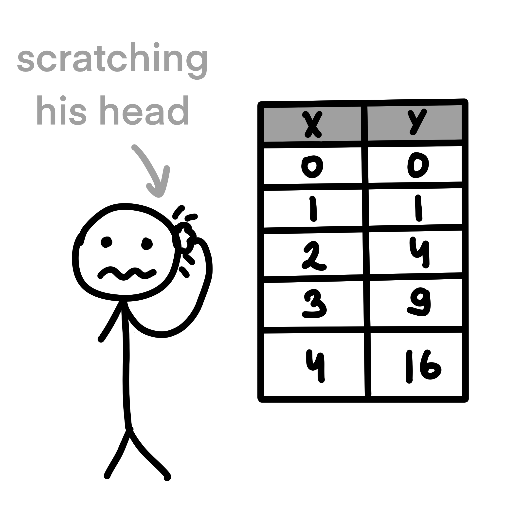
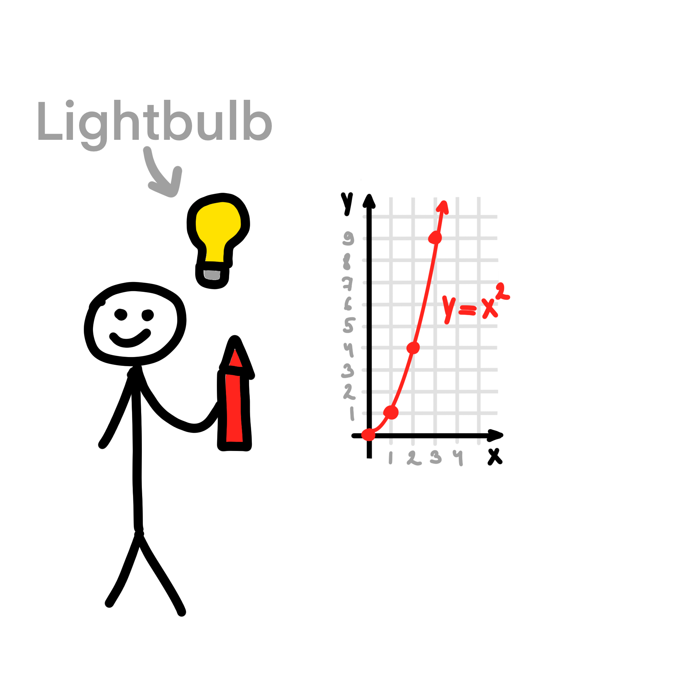

# Relationship between variables

Both scatter plots and line plots visualize the relationship between variables, but they do it the different ways.
Scatter plots show the distribution of individual data points
and help identify patterns, correlations, clusters, or outliers.
On the other hand, line plots are suitable for showing the change over time.

Let's say Andy was assigned to define a relationship between variables `x` and `y`, but Andy can't see the relationship by 
just looking at the numbers in the table. Thus, he decided to plot them using a scatter plot. After a while, he noticed 
that if you connect the points, the graph looks like a parabola, so the relationship is pretty simple: `y = x^2`.

