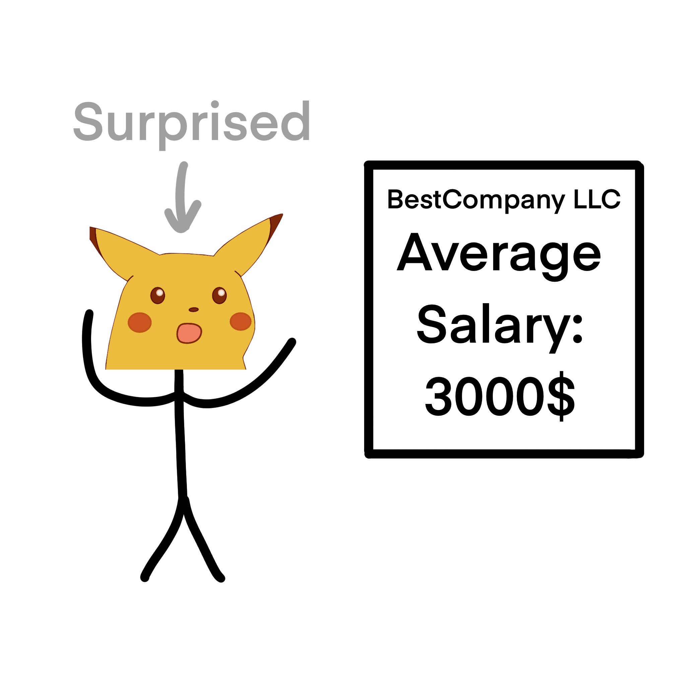
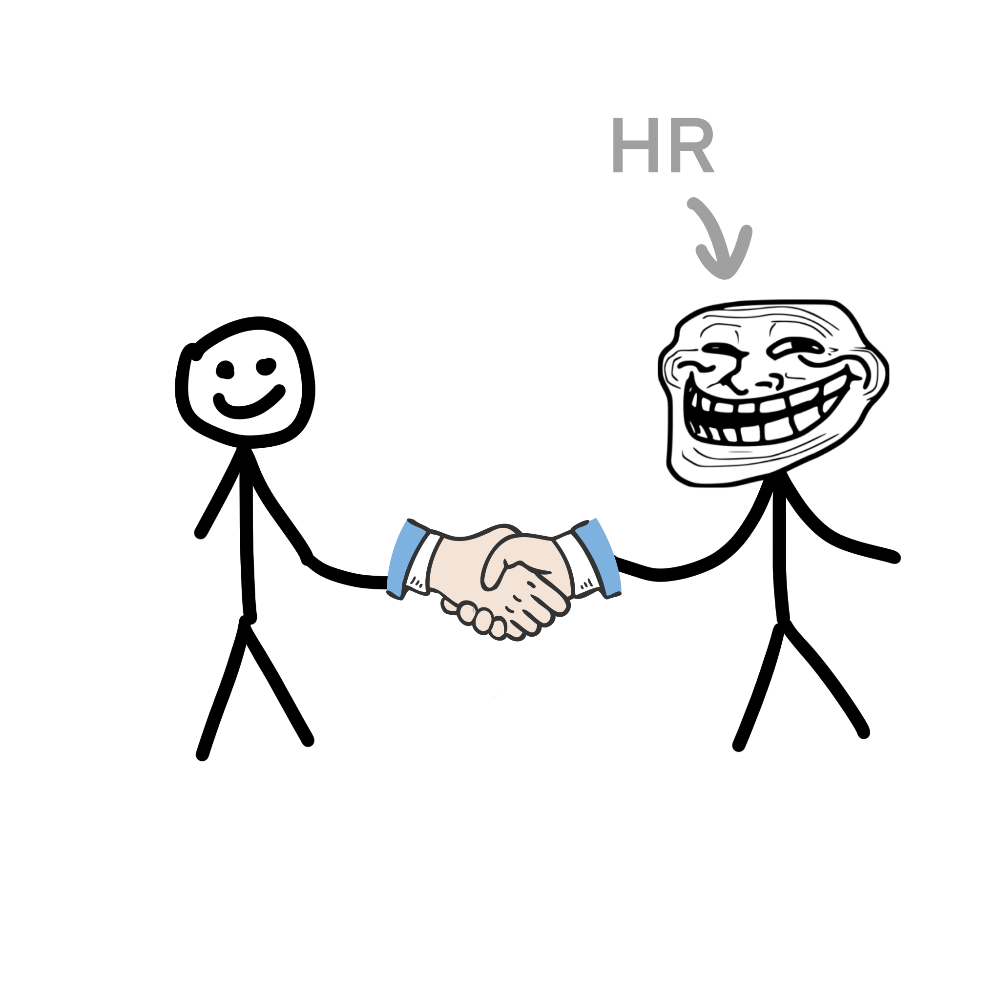
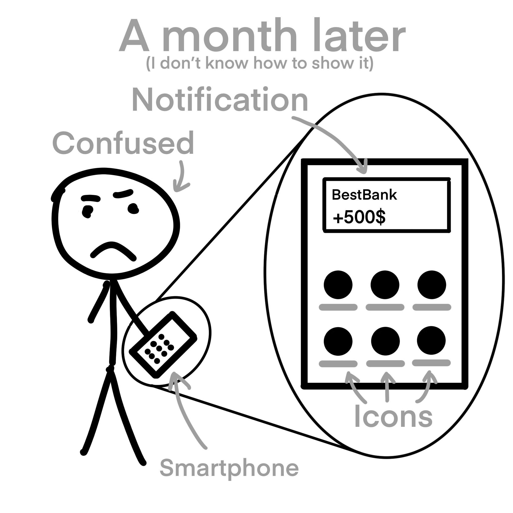
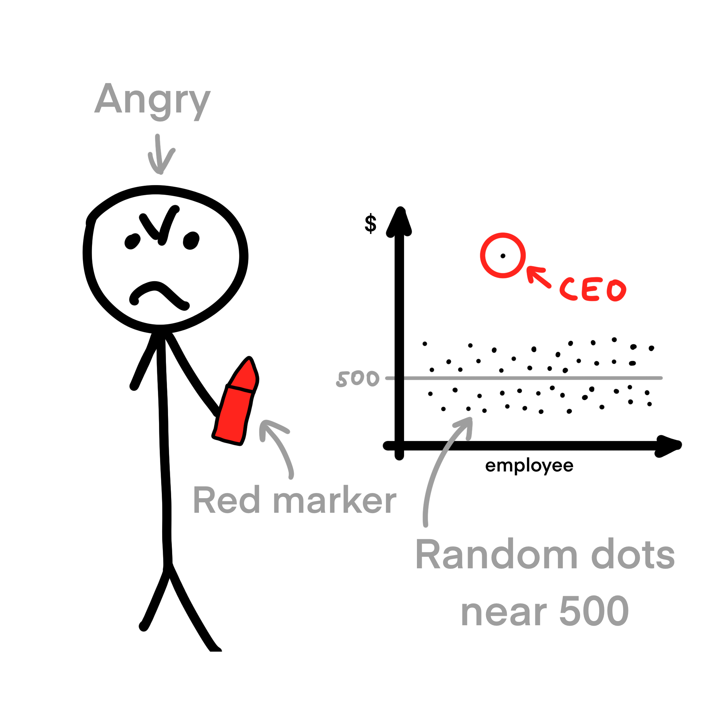

# Outliers

If you suspect the presence of outliers in your data, a scatterplot is better suited for identifying them.
Outliers often appear as data points that significantly deviate from the general trend.
Conversely, line plots may not clearly exhibit outliers, as they continuously connect data points.

While searching for his first job, Andy came across a position with an average salary of $3,000.
Excited, he immediately went for an interview and received an offer.
Andy happily signed all the documents without reading them.
After a month of hard work, he finally received the salary... $500.
Andy was confused.
Since he had access to all the salaries in the company, 
he decided to build a scatter plot with them and discovered the outlier!
It was the CEO, whose salary was much higher than that of the other employees.
Because of this, the average salary was much higher than what most employees actually earned.
Andy was furious and never worked for that company again. Since then, he has made sure to read every document he signs.

