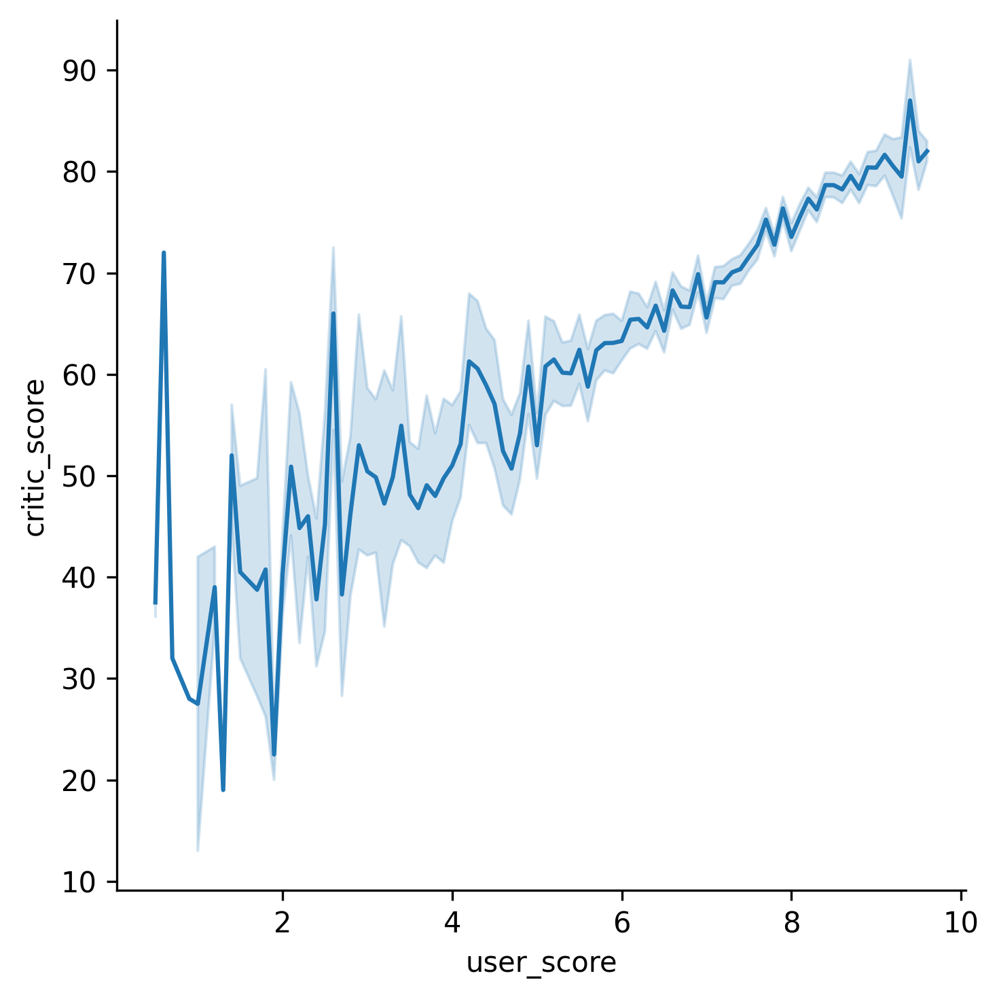

## Theory

Much better, we can determine the big dense cluster in our dataset with this visualization.
Moreover, we can determine that there is some kind of linear dependency between the two scores.
Let's try to make a linear approximation of the data to check it.

As mentioned before, `relplot` can build not only scatter plots but also line plots.
To instruct `relplot` what kind of plot to build, we can use the `kind` parameter,
which accepts one of the following strings: `scatter` for scatter plots and `line` for line plots.
In the previous steps, there was no need to explicitly assign `scatter` to this parameter,
because it is its default value.

## Task

Make `relplot` build a line plot. Note that you now don't need to make the plot transparent and colorize it.

## Hints

  

