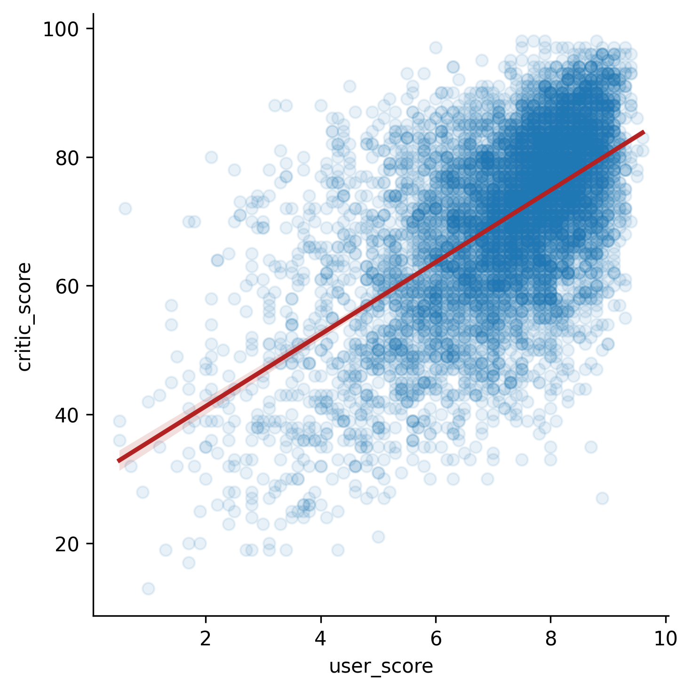

## Theory

The figure looks very overwhelming at first sight and not understandable at all.
Let's tune the visualization parameters a bit.
Since in the figure above we have both scatter points and linear plot,
to specify distinct parameters for each type of visualizations,
we should use `scatter_kws` and `line_kws` parameters.

Both of these parameters accept a dictionary of parameters 
that will be further passed to corresponding plotting functions.
The already familiar `color` and `alpha` can be passed within these dictionaries.

## Task

Colorize the line with `firebrick` color and set the scatter transparency to `0.1`.

## Hints

   

