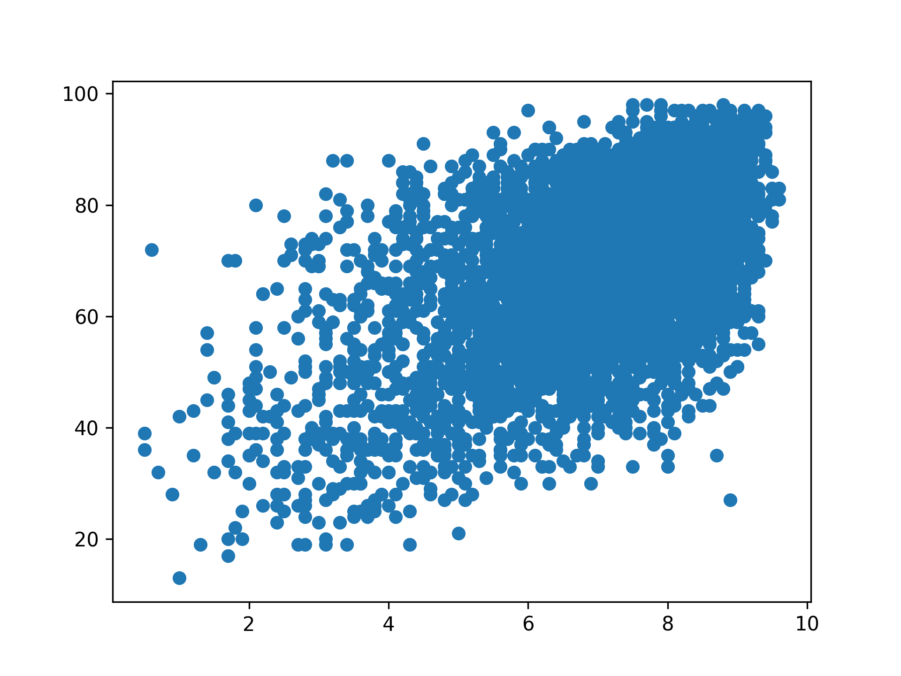

## Goal

The main goal of the lesson is to **plot the correlation between the user score and the critic score**.

## Theory

In matplotlib, there are several ways to plot relational graphs, but we will focus on two of them:

1. Using [`scatter`](https://matplotlib.org/stable/api/_as_gen/matplotlib.pyplot.scatter.html).
   This function can build scatter plots.
2. Using [`plot`](https://matplotlib.org/stable/api/_as_gen/matplotlib.pyplot.plot.html).
   This function can build line plots.

For now, we will work with the `scatter` function.

Every plotting function in matplotlib accepts three main arguments:

* `data` – Input data structure. In this course, we will pass pandas dataframes here.
* `x` – Name of a column to visualize on x-axis.
* `y` – Name of a column to visualize on y-axis.

But there are several things that you need to note:

1. `data` is optional. In this case, `x` and `y` must be lists containing some data.
2. You can only specify the `data` parameter as a keyword parameter.
3. You can only specify the `x` and `y` parameter as a positional parameter.

To start building something with matplotlib you need
to create [`Figure`](https://matplotlib.org/stable/api/_as_gen/matplotlib.figure.Figure.html) and
(at least one) [`Axes`](https://matplotlib.org/stable/api/_as_gen/matplotlib.axes.Axes.html#matplotlib.axes.Axes).
You can think about `Figure` as a container for several `Axes` in which actual plotting is done.

To create `Figure` and (single) `Axes` we can use
the [`subplots`](https://matplotlib.org/stable/api/_as_gen/matplotlib.pyplot.subplots.html)
function: `fig, ax = plt.subplots()`.
Note that we are using the common abbreviation for `Figure` (`fig`) and `Axes` (`ax`) here.
We are also using the common alias for matplotlib (`plt`),
which we defined during import: `import matplotlib.pyplot as plt`.

Be aware of the difference between `Axes` and [`Axis`](https://matplotlib.org/stable/api/axis_api.html#axis-objects):
`Axes` can contain several `Axis` (usually, x-axis and y-axis).

As we said earlier, the actual plotting is done in `Axes`, 
so to plot something in the figure you should call some function from the `Axes` instance.
For example, to plot scatter, we should write something like this: `ax.scatter('x', 'y', data=my_data)`.

Let's do some practice!

## Task

1. Create the instance of `Figure` and `Axes` in the `plot` function.
2. Plot a scatter there the x-axis is `user_score`, the y-axis is `critic_score` and the data is `games`.

Note that we preprocessed the data for you, but if you want, you can do this by yourself.
Please see the corresponding hint below.

## Hints

   To run the code, you should click on the green triangle next to the entry point. In case of execution errors,
   they will be shown in the console inside the IDE. 
   

   After running the code, the graph will be generated next to the task.py file.

   

   Before using the data, we need to make several preprocessing steps:
   <ol>
      <li>Lower column names.</li>
      <li>Remove games with user scores to be decided (the user score is equal to <code>tbd</code>).</li>
      <li>Drop all nans.</li>
      <li>Convert the <code>user_score</code> column to float.</li>
   </ol>
   
   If you have some difficulties with your own preprocessing, you can
   have [a sneak to the inner file](file://1_2_line_and_scatter_plots_matplotlib/1_theory/1_scatter/data.py)
   where our preprocessing is defined.
   
   Note that your own preprocessing function will not be tested.

   

