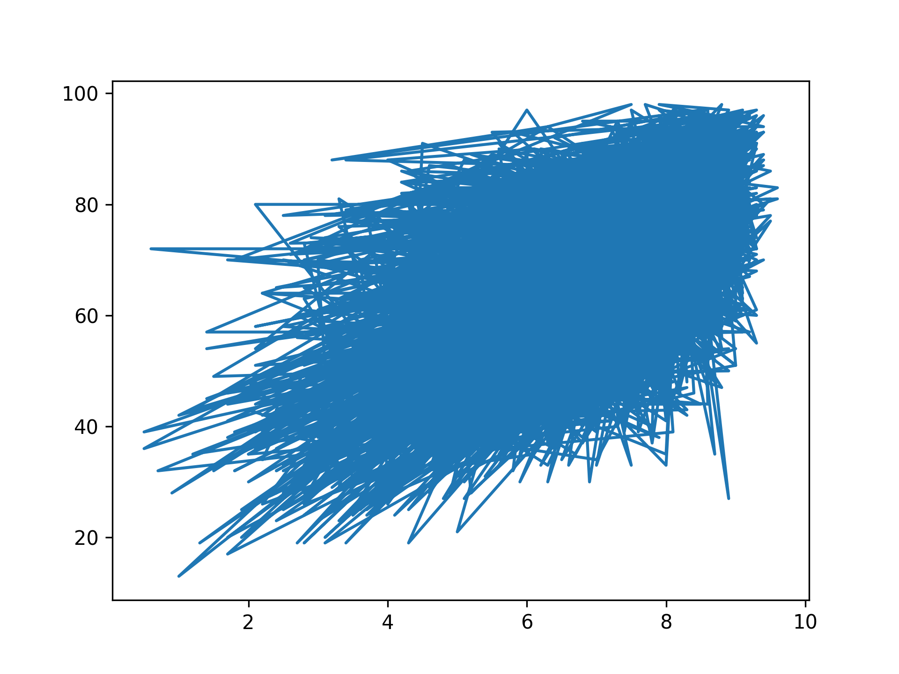

## Theory

Much better, we can determine the big dense cluster in our dataset with this visualization. Moreover, we can determine
that there is some kind of linear dependency between the two scores. Let's try to make a linear approximation of the
data to check it.

As mentioned before, `plot` can help you to build a linear plot. So let's try to apply it here.

## Task

Replace the `scatter` call with `plot`.

Note that you now don't need to make the plot transparent and colorize it.

## Hints

   

