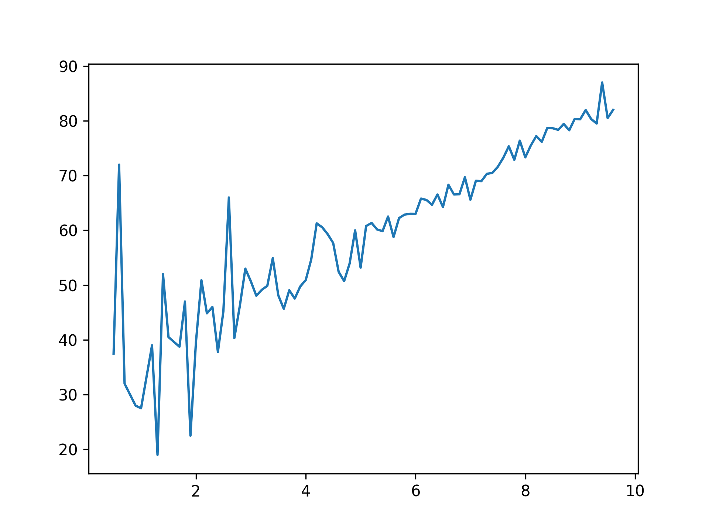

## Theory

## Task

Add a call of the hidden `aggregate` function to the `plot` function. This function will calculate the mean critic
score for every user score and return the table with columns: `user_score` and `critic_score`.

If you want, you can aggregate the data by yourself. Please see the corresponding hint below.

## Hints

TODO

