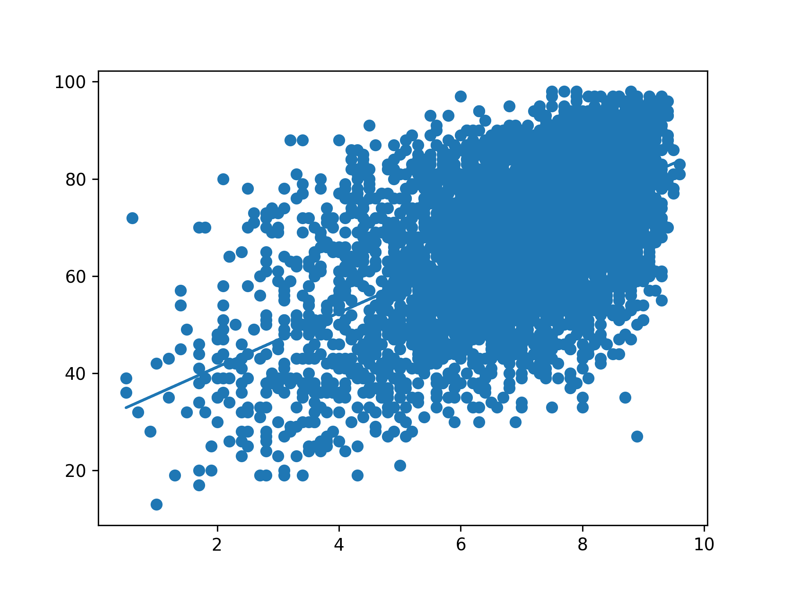

## Theory

## Task

The `aggregate` function now estimates the critic scores using the regression line. If you want, you can aggregate the
data by yourself. Please see the corresponding hint below.

Plot all relationships between `user_score` and `critic_score` using `scatter` on the same figure.

## Hints

TODO

TODO

