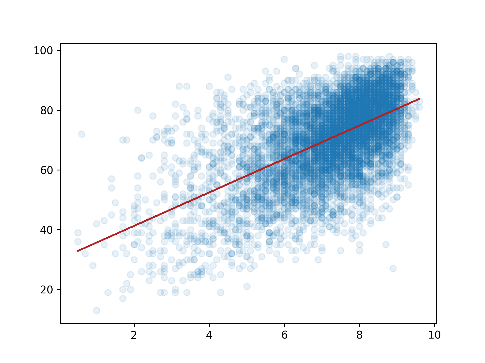

## Theory

The figure looks overwhelming at first sight and is not understandable at all. Let's tune the visualization parameters
a bit.

## Task

Color the line `firebrick` and set the scatter transparency to `0.1`.

## Hints

   

