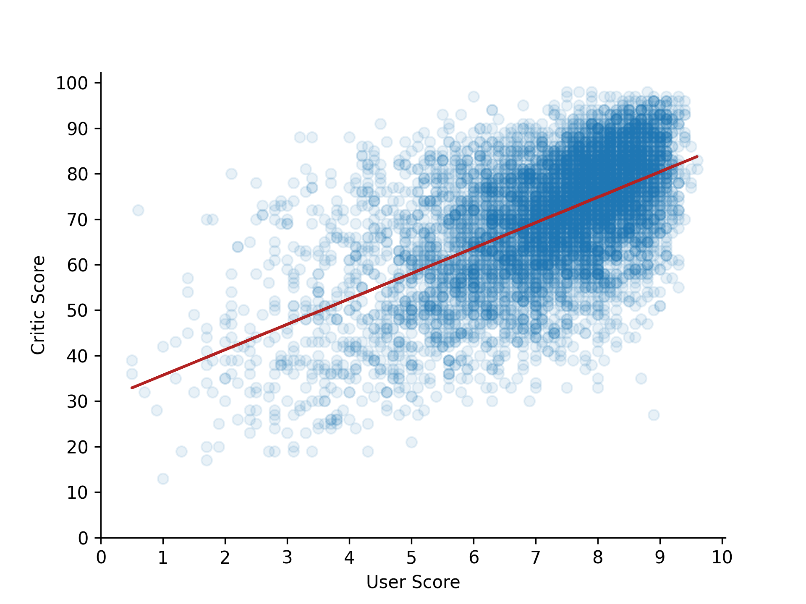

## Theory

Now the figure looks good, but let's tune it a little bit.

For example, our figure doesn't have axis labels. To set them we can
use [`set_xlabel`](https://matplotlib.org/stable/api/_as_gen/matplotlib.axes.Axes.set_xlabel.html)
and [`set_ylabel`](https://matplotlib.org/stable/api/_as_gen/matplotlib.axes.Axes.set_ylabel.html) methods.

Also, we can change how ticks are distributed. To manual set ticks we can pass desirable tick positions to
the [`set_xticks`](https://matplotlib.org/stable/api/_as_gen/matplotlib.axes.Axes.set_xticks.html)
and [`set_yticks`](https://matplotlib.org/stable/api/_as_gen/matplotlib.axes.Axes.set_yticks.html) methods.

Another feature that is good to be aware of is limiting the view range of x-axis and y-axis. To do it we can
use [`set_xlim`](https://matplotlib.org/stable/api/_as_gen/matplotlib.axes.Axes.set_xlim.html)
and [`set_ylim`](https://matplotlib.org/stable/api/_as_gen/matplotlib.axes.Axes.ylim.html) respectively.

Our figure looks like it is "trapped" inside a box. 
These black lines that surround the figure call 
[`Spines`](https://matplotlib.org/stable/api/spines_api.html#matplotlib.spines.Spine)
and there are four of them: `top`, `bottom`, `left`, `right`.
We can refer to them in the following ways: `ax.spines['left']` or `ax.spines[['left', 'right']]`.
To make them disappear, we should call the `set_visible` method.

## Task

1. Change x-label to `User Score` and y-label to `Critic Score`
2. Set the ticks on the x-axis from `0` to `10` without skips. 
3. Set the ticks on the y-axis from `0` to `100` every `10`.
4. Remove the top and right spines from the figure.

## Hints

   

