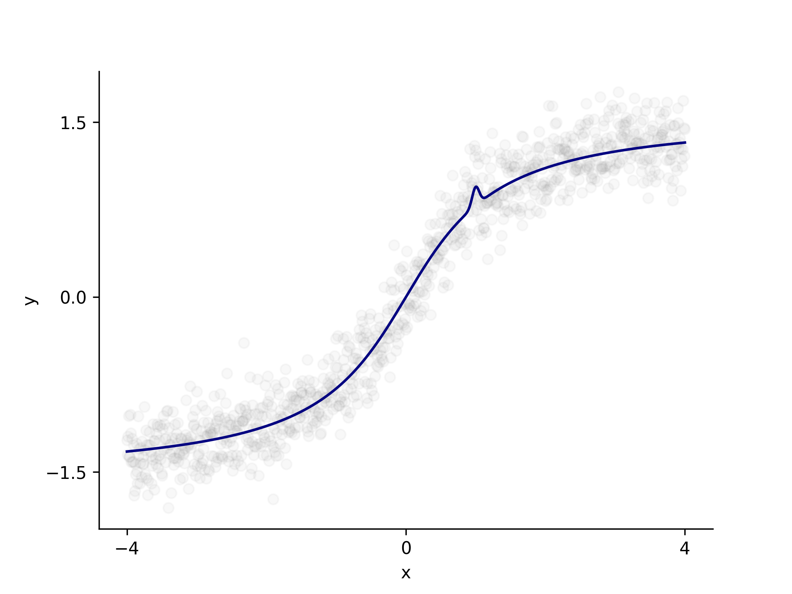

## Task

During an experiment, researchers recorded the subject's `y` variable while changing the `x` variable.
This was a secretive study, so they haven't provided any additional details, but they mentioned finding something unusual in the observations.
The researchers approximated the data (`approximated_y`)
and are now seeking help with plotting it to observe this unexpected behavior in a figure.
Let's assist them!

Our figure should consist of two traces: a line trace and a scatter trace.
The line trace should plot the approximated data, while the scatter trace should plot the actual data.

You should also make several visual adjustments:

1. The line trace should bе `navy`.
2. The scatter trace should be `grey` and almost transparent (`0.05`).
3. Limit the x-axis view to the interval from `-4` to `4`.
4. The x-axis should have only three ticks: `-4`, `0`, and `4`.
5. Label the x-axis as `x`.
6. Limit the y-axis view to the interval from `-2` to `2`.
7. The y-axis should have only three ticks: `-1.5`, `0`, and `1.5`.
8. Label the y-axis as `y`.
9. Remove the top and right spines.

Note that you don't need to preprocess the data.

If you get stuck,
please feel free to use the hints below, where you can also find what the final figure should look like.

## Hints

    

    To color the line or scatter plot, you can use the <code>color</code> argument:
    <code>ax.line("x", "y", data=my_data, color="color_name")</code>.

    To make the line or scatter plot transparent, you can use the <code>alpha</code> argument:
    <code>ax.scatter("x", "y", data=my_data, alpha=0.5)</code>.

    To limit an axis view, you can use the <code>set_xlim</code> or <code>set_ylim</code> method of the <code>Axes</code> object:
    <code>ax.set_xlim(1, 3)</code>.

    To set ticks, you can use the <code>set_xticks</code> or <code>set_yticks</code> method of the <code>Axes</code> object:
    <code>ax.set_xticks([1, 2, 3])</code>.

    To set a label for an axis, you can use the <code>set_xlabel</code> or <code>set_ylabel</code> method of the <code>Axes</code> object:
    <code>ax.set_xlabel("x")</code>.

    To remove a spine, you can use the <code>set_visible</code> method of the <code>Spine</code> object:
    <code>ax.spines["bottom"].set_visible(False)</code>.

