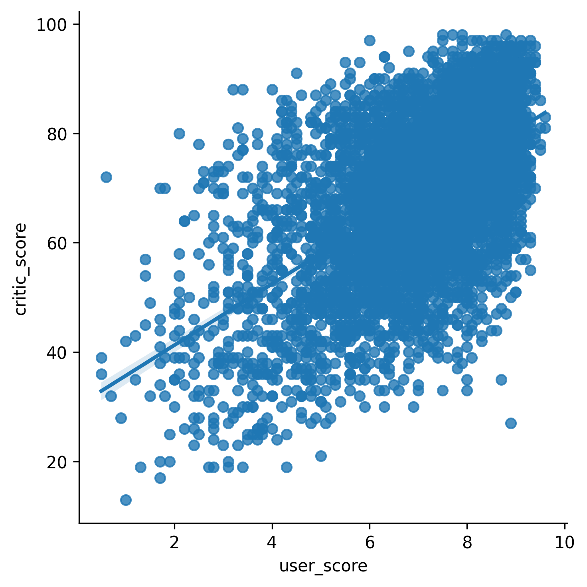

## Theory

Let's try to understand what is going on in our graph. We can definitely see an uptrend, but it is not a straight line.
This happened because `relplot` can only plot simple lines and when it comes to the data preprocessing before plotting, 
it can only do some common aggregation like calculating mean, median, min, max, etc.

In our case, by default it calculated the mean between `critic_score`'s that correspond to a common `user_score`. The
aggregation function
can be set with the `estimator` parameter. The area between the line is an error bar, which represents how well the
aggregation represents the initial data. There
are [several types of error bars](https://seaborn.pydata.org/tutorial/error_bars.html) that can be set with
the `errorbar` parameter.

So how do we plot a straight line showing a trend? For that, we can use the seaborn
function [`lmplot`](https://seaborn.pydata.org/generated/seaborn.lmplot.html), which plots the data and a linear regression
model fit.

## Task

Modify the `plot` function by replacing a `relplot` call with `lmplot` and removing the `kind` parameter.

## Hints

TODO

