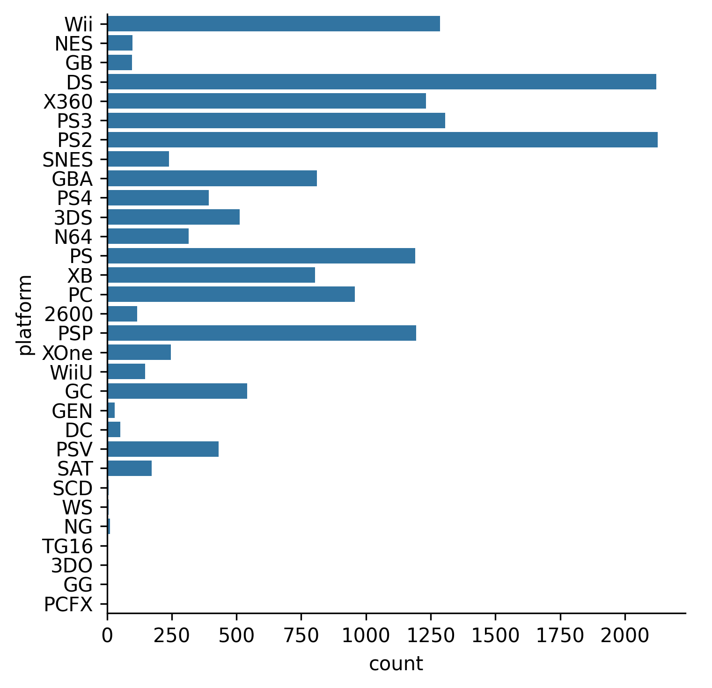

## Theory

Here we can see that we have many platforms in the dataset,
so the figure is not understandable due to overlapping of labels in the x-axis.
We can solve it either via reducing the number of groups 
or just changing the layout of the figure by relocating labels from the x-axis to the y-axis.

Seaborn makes it easy to change layout: we just need to swap `x` and `y`. 
But in case of a count plot, we need to replace `x` with `y` or vice versa,
as this kind of plot accepts only one axis per time.

## Task

Change the figure's layout by replacing the x-axis with the y-axis.

## Hints

   Please note that your figure might be slightly different, because of the way Seaborn calculates error bars.

   

