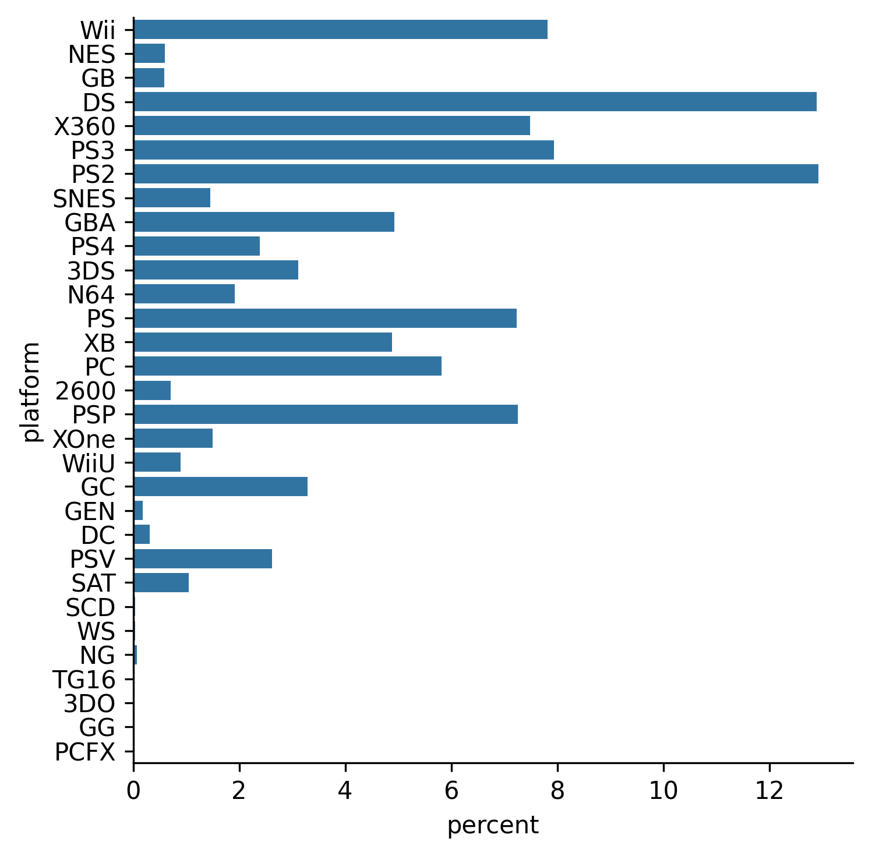

## Theory

Finally, we can see all the platform names, 
but it is not clear from the current data what percentage each platform occupies among the others.

Luckily, count plot has a special argument called `stat`, that changes the calculated statistics.
This argument accepts the following values:
1. `count`: number of observations per category.
2. `proportion`: similar to `count`, but normalized so that all bars sum to `1`.
3. `percent`: similar to `count`, but normalized so that all bars sum to `100`.
4. `probability`: alias to `proportion`.

## Task

Change the statistic to `percent`.

## Hints

   

