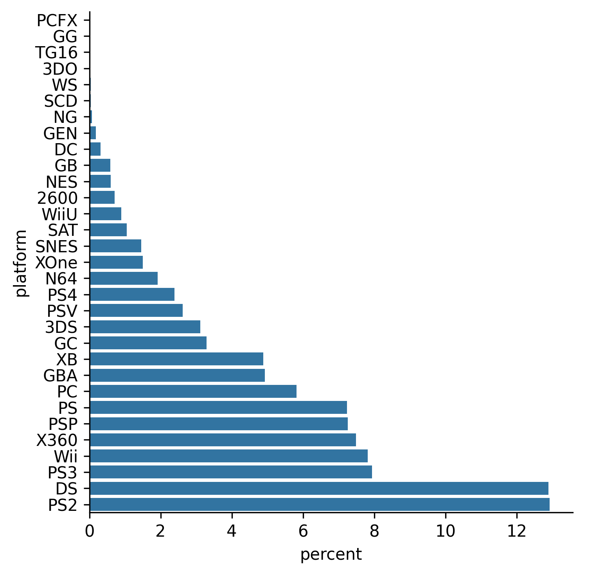

## Theory

Now it is a little bit better, but it is still not convenient for exploration.
To understand more easily which platforms are more popular, we can reorder them.

The order of categories is controlled by the `order` argument. 
It accepts a list of names in what order to show them.

## Task

Use the hidden `get_sorted_platforms` function
to get the list of platforms in ascending order and pass it to the `catplot` function.

If you prefer, you can sort the platforms yourself. Please refer to the corresponding hint below.

## Hints

    To sort the platforms you can use
    the <a href="https://pandas.pydata.org/docs/reference/api/pandas.Series.value_counts.html"><code>value_counts</code></a> function
    on the <code>platform</code> column:
    <ol>
        <li>Pass there the <code>sort</code> argument, along with <code>ascending</code>.</li>
        <li>After that, use the <a href="https://pandas.pydata.org/docs/reference/api/pandas.Series.index.html"><code>index</code></a> property to receive sorted platform names.</li>
        <li>Finally, convert the <code>Index</code> object to a list using the <a href="https://pandas.pydata.org/docs/reference/api/pandas.Index.to_list.html"><code>to_list</code></a> function.</li>
    </ol>
    
   If you have some difficulties with your own preprocessing, you can take
   [a peek at the inner file](file://2_1_bar_and_pie_charts_seaborn/1_theory/4_countplot_order/data.py)
   where our preprocessing is defined.
    

   

