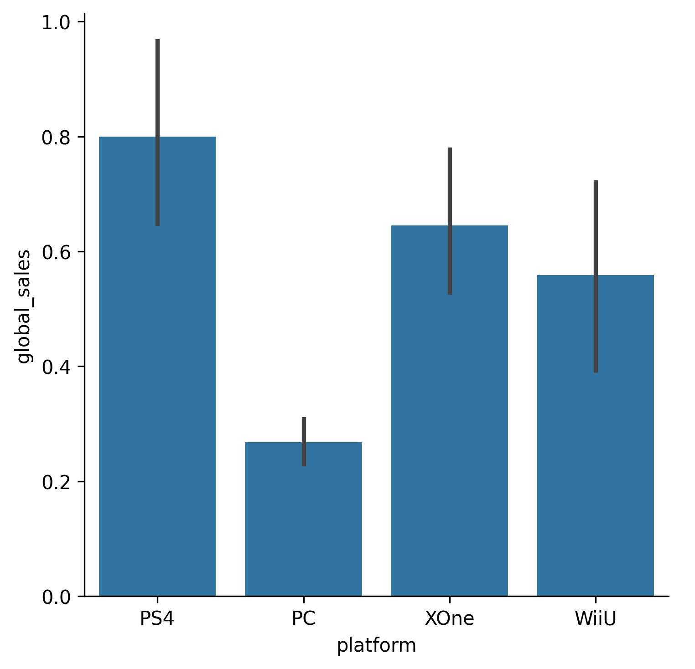

## Theory

Now that we've explored the popularity of platforms, let's look at global sales among some platforms.
To do this, we still can use `catplot` but different kind – `bar`.

As we saw on the previous charts, we have a lot of game platforms, including "ancient" ones,
so let's focus only on the most modern ones: `PS4`, `PC`, `XOne` and `WiiU`. 

## Task

1. Use the hidden `filter_platforms` function to filter out old game platforms.
2. Change the `kind` argument to `bar` and plot `global_sales` among the y-axis.

If you prefer, you can filter out the platforms yourself. Please refer to the corresponding hint below.

Please note that you don't need to specify the `order` and `stat` arguments,
and bar charts should be in a vertical layout now.

## Hints

    To filter out the unnecessary platforms you can use
    the <a href="https://pandas.pydata.org/docs/reference/api/pandas.Series.isin.html"><code>is_in</code></a> function
    on the <code>platform</code> column.

   Please note that your figure might be slightly different, because of the way Seaborn calculates error bars. 
   
   

