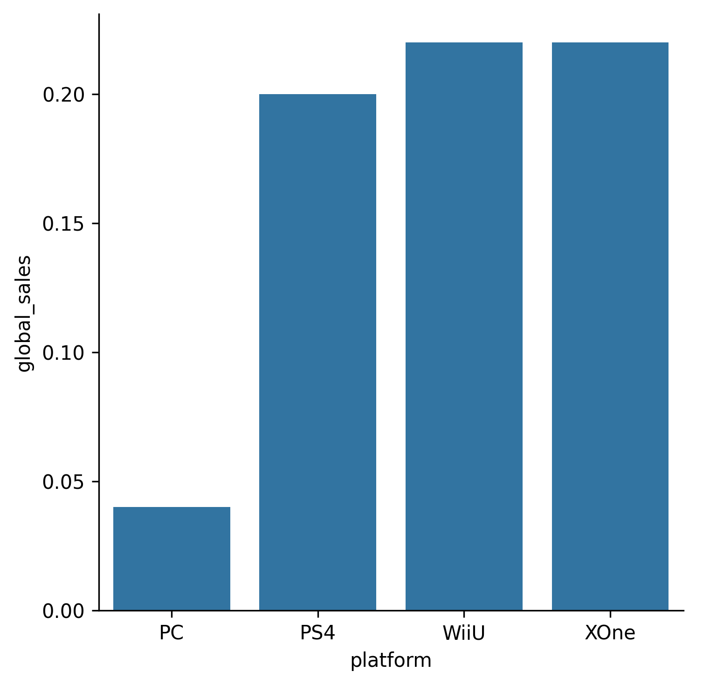

## Theory

Now we can see global sales per platform, but now each bar has a strange line called *error bar*.

As for each platform we have many global sales data, 
Seaborn aggregates them to plot a single value for each platform 
and provides a visual cue about how well this value represents the underlying data points. 

We had something similar when we tried to find the trend using line plot in one of the 
[previous](course://1_1_line_and_scatter_plots_seaborn/1_theory/4_lmplot) Seaborn lessons.
And now it's time take a more detailed look at the `estimator` argument.

To control aggregation, you can use the `estimator` argument, which accepts:
1. A callable that maps vector to scalar data.
2. Numpy function names like `min`, `max`, `sum`, `mean` or `median`.

By default, Seaborn uses `mean` as an estimator.

There are [several types of error bars](https://seaborn.pydata.org/tutorial/error_bars.html),
which can be set with the `errorbar` parameter. To disable it, you just need to pass `None` as a value

## Task

1. Change the estimator to `median` and remove the error bar.
2. Sort the platforms using the hidden `get_sorted_platforms` function.

If you prefer, you can sort the platforms yourself. Please refer to the corresponding hint below.

## Hints

    To sort the platforms you need to:
    <ol>
        <li>Group the data by the <code>platform</code> column.</li>
        <li>Calculate median using the <a href="https://pandas.pydata.org/docs/reference/api/pandas.Series.median.html"><code>median</code></a> function on the <code>global_sales</code> column.</li>
        <li>Sort the values using <a href="https://pandas.pydata.org/docs/reference/api/pandas.Series.sort_values.html"><code>sort_values</code></a> function.</li>
        <li>Use the <a href="https://pandas.pydata.org/docs/reference/api/pandas.Series.index.html"><code>index</code></a> property to receive sorted platform names.</li>
        <li>Convert the <code>Index</code> object to a list using the <a href="https://pandas.pydata.org/docs/reference/api/pandas.Index.to_list.html"><code>to_list</code></a> function.</li>
    </ol>
    
   If you have some difficulties with your own preprocessing, you can take
   [a peek at the inner file](file://2_1_bar_and_pie_charts_seaborn/1_theory/6_catplot_estimator/data.py)
   where our preprocessing is defined.

   

