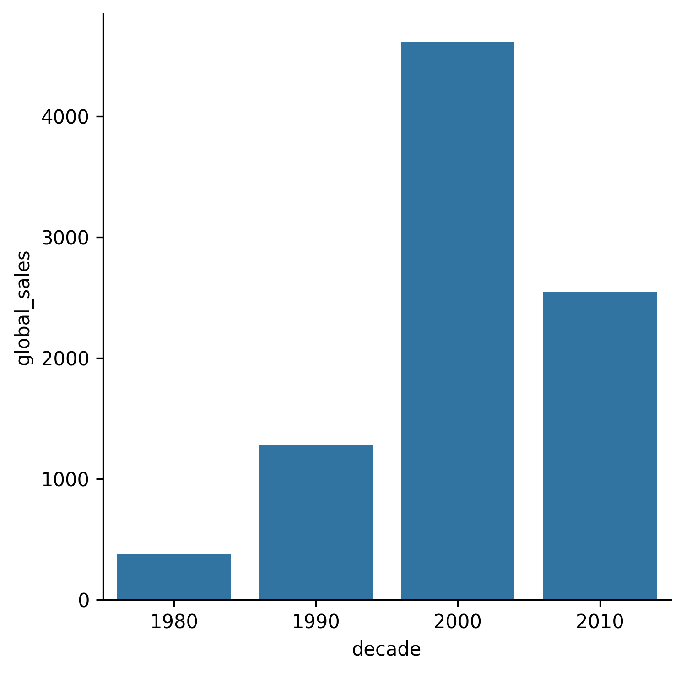

## Theory

Now we have plotted continuous values (global sales) for each of the categorical values (platforms),
but what if we have two continuous variables?
More precisely, what do we do if we want to compare global sales over some years?

We can do it using line plot, 
but if the number of possible categories is small (for example, if we look only at decades),
then the bar chart is also suitable for this purpose.

## Task

Use the hidden `add_decades` function to add a new column `decade` to the data 
and plot _**total number**_ of global sales by decades.

Please note that you don't need to reorder columns now as they are sorted automatically.

If you prefer, you can add the decades yourself. Please refer to the corresponding hint below.

## Hints

   

   To plot total number of global sales you should use the <code>estimator</code> argument 
   and pass there the <code>sum</code> value.

    To add the decades you could use the <a href="https://pandas.pydata.org/docs/reference/api/pandas.cut.html"><code>cut</code></a> function.

