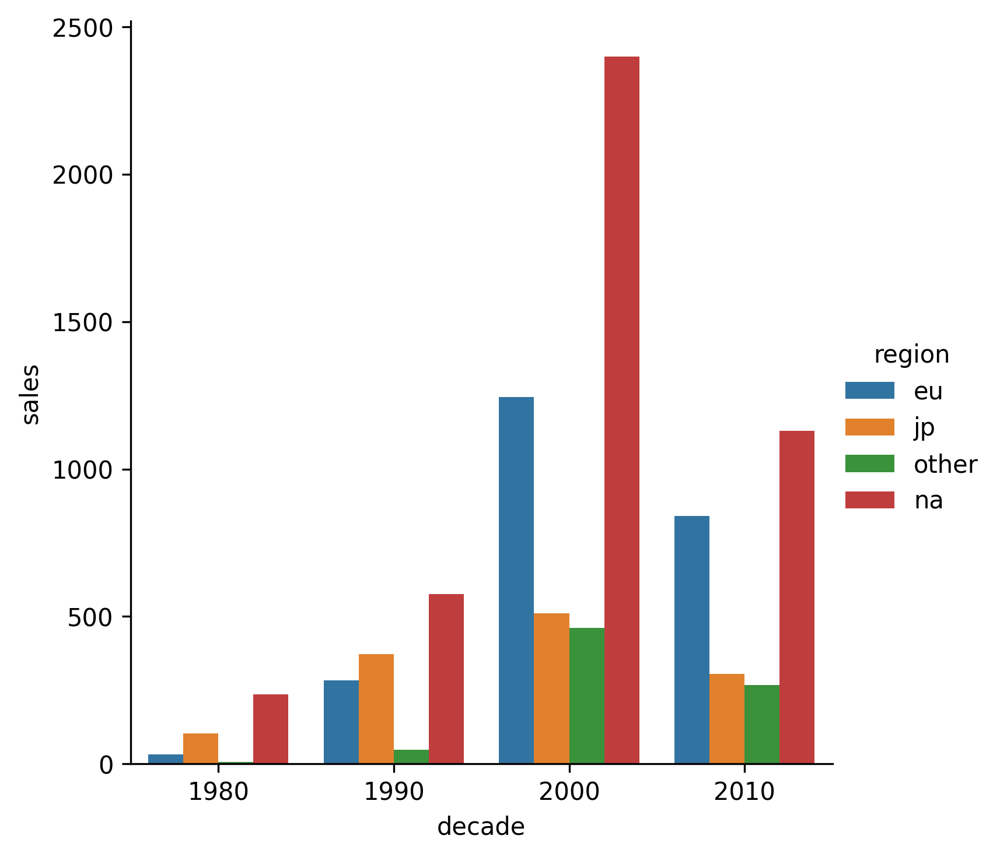

## Theory

It is interesting to see that the total number of global sales was lower in 2010 than in 2000.
It is probably because we have incomplete data for the games from that decade.

Another advantage of the bar charts is that we can put another one category into analysis quite easily.
Assume that we want to distinguish the most popular sales regions for each of decade,
we can conduct it using the `hue` argument.
It can create bars for each region, color it with different colors and place them next to each other for each decade.
If it sounds too complex for you, then let's jump into the task to see how it works in practice!

## Task

1. Using the hidden `extract_sales_region` extract a sales region and a value
   from the `eu_sales`, `jp_sales`, `na_sales` and `other_sales` columns.
   
   This function unpivot the data by creating four new rows for each game with two new columns:
   `region` (can be `eu`, `jp`, `na` or `other`) and `sales`.
2. Plot the `sales` column along the y-axis instead of `global_sales`.
3. Pass the `region` value to the `hue` argument. 

If you prefer, you can extract the regions yourself. Please refer to the corresponding hint below.

## Hints

   To plot total number of global sales you should use the <code>estimator</code> argument 
   and pass there the <code>sum</code> value.

    To extract the regions you could use the <a href="https://pandas.pydata.org/docs/reference/api/pandas.melt.html"><code>melt</code></a> function.
    
   If you have some difficulties with your own preprocessing, you can take
   [a peek at the inner file](file://2_1_bar_and_pie_charts_seaborn/1_theory/8_catplot_grouping/data.py)
   where our preprocessing is defined.

   

