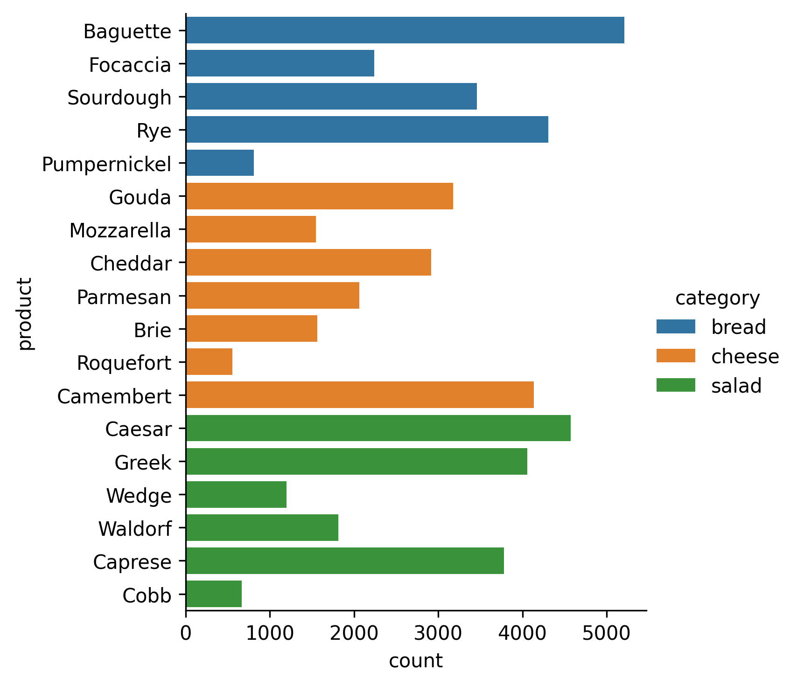

## Task

At a recent tasting event, participants were invited to sample an assortment of breads, cheeses, and salads.
Everyone had the chance to vote for up to three products per category,
sharing their favorites among the diverse offerings.
The organizers of a tasting event received all the responses,
calculated themselves the percentage of votes for each product in each category
(so that they know the corresponding distribution along cheese, bread, and salad).
Now they want us to help with plotting the data.
Let's help them!

To interpret the data,
the organizers want to see the distribution of votes for each category (`category`) in a single horizontal bar
chart.
So you should plot categories from top to bottom as follows: `bread`, `cheese`, and `salad`.

The other requirements are:

1. The bar chart should be horizontal.
2. The bar chart should have the legend.
3. The bars should be grouped by category.

Note that you don't need to preprocess the data.

You could also use the hidden `get_product_order` to get all products in the necessary order.

If you get stuck, please feel free to use the hints below, where you can also find what the final figure should look
like.

## Hints

    

    To make the bar horizontal, you can change the <code>x</code> argument to <code>y</code>.

    To add the legend, you can use the <code>hue</code> argument.

    To group the bars by category, you could use the <code>order</code> argument.

