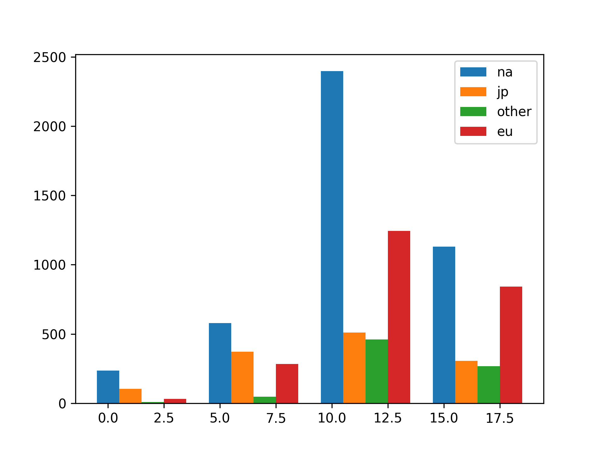

## Theory

Great! Now we finally have all regions plotted together! But it is not clear which trace belongs to which region. 
The legend could help fix this.
To tell Matplotlib to add the legend to our figure we should call the `ax.layout` functon.

But after doing that, you will see that nothing happened.
This is because Matplotlib doesn't know the names of the regions.
To fix this, we should pass the name to the `bar` function via the `label` argument.

## Task

1. Pass the region name as the `label` argument in the `bar` function.
2. Add the layout to the figure.

## Hints

   

