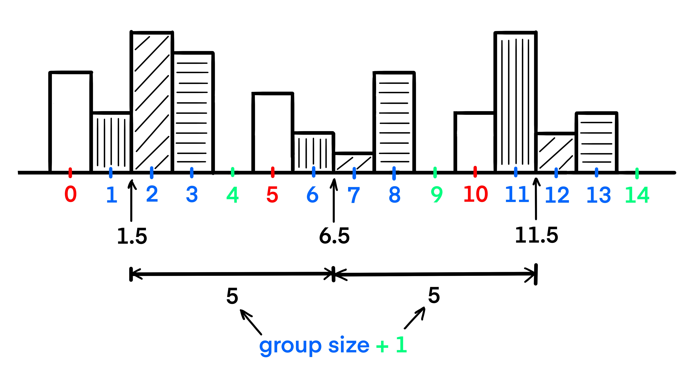
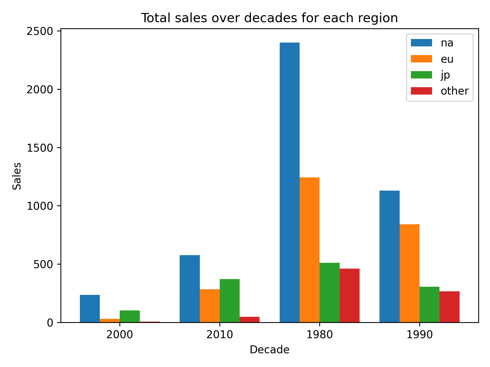

## Theory

Now we can understand the traces, but there are no decade labels.
To add them, we can use the familiar `ax.set_xticks` function.

Previously we passed there only the positions where ticks should be made, however,
we can also pass to this function as a second argument the labels for these ticks,
which will be shown instead of the numeric ones.

So let's go back to our example.
We need to place the labels at the center of our groups.
As you can see from the picture, the center of the first group is located at `1.5`.
It is not hard to calculate other centers since they are spaced at a distance from each other equal to `group_size + 1`. 

Also, let's add labels for x-axis and y-axis, title and tighten the layout.

## Task

1. Add decade labels to the figure. 

   You can use the hidden `get_decades` function to get all decades.
   If you prefer, you can do it yourself. Please refer to the corresponding hints below.

2. Set x-axis label to `Decade`.
3. Set y-axis label to `Sales`.
4. Set title to `Total sales over decades for each region`.
5. Tighten the layout.

## Hints

    To set a title for a figure, you can use the <code>set_title</code> method of the <code>Figure</code> object:
    <code>fig.set_title("Title")</code>.

   

