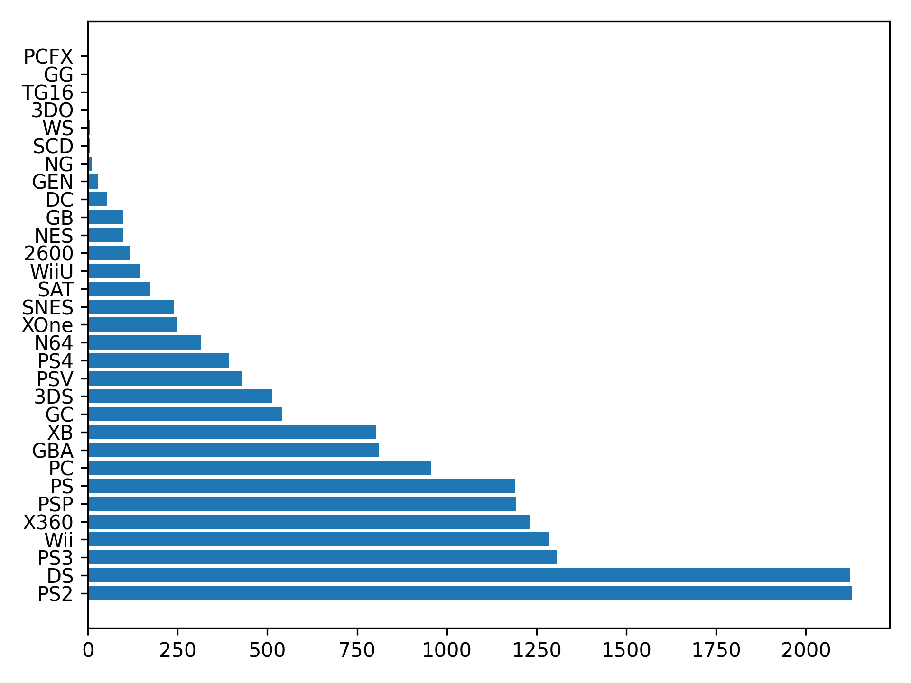

## Theory

Here we can see that we have many platforms in the dataset,
so the figure is not understandable due to overlapping of labels in the x-axis.
We can solve it either via reducing the number of groups 
or just changing the layout of the figure by relocating labels from the x-axis to the y-axis.

To change the layout of the bar chart, we need to use different plotting function -- 
[`barh`]((https://matplotlib.org/stable/api/_as_gen/matplotlib.axes.Axes.barh.html)).
The only differences with the previous `bar` function are:
1. `barh` plots horizontal bar chart while `bar` builds vertical bar charts.
2. Since the layout has changed, the first argument is now called `y` and the second argument is now called `width`.

After doing this, you will see that the labels are still very close to each other.
To fix this, we could use 
the [`fig.tight_layout`](https://matplotlib.org/stable/api/_as_gen/matplotlib.pyplot.tight_layout.html) function,
which adjust the padding between and around elements of the figure.
Please note that you should call this function AFTER plotting all the necessary data on the plot.

## Task

Change the figure's layout to horizontal and adjust the padding.

## Hints

   

