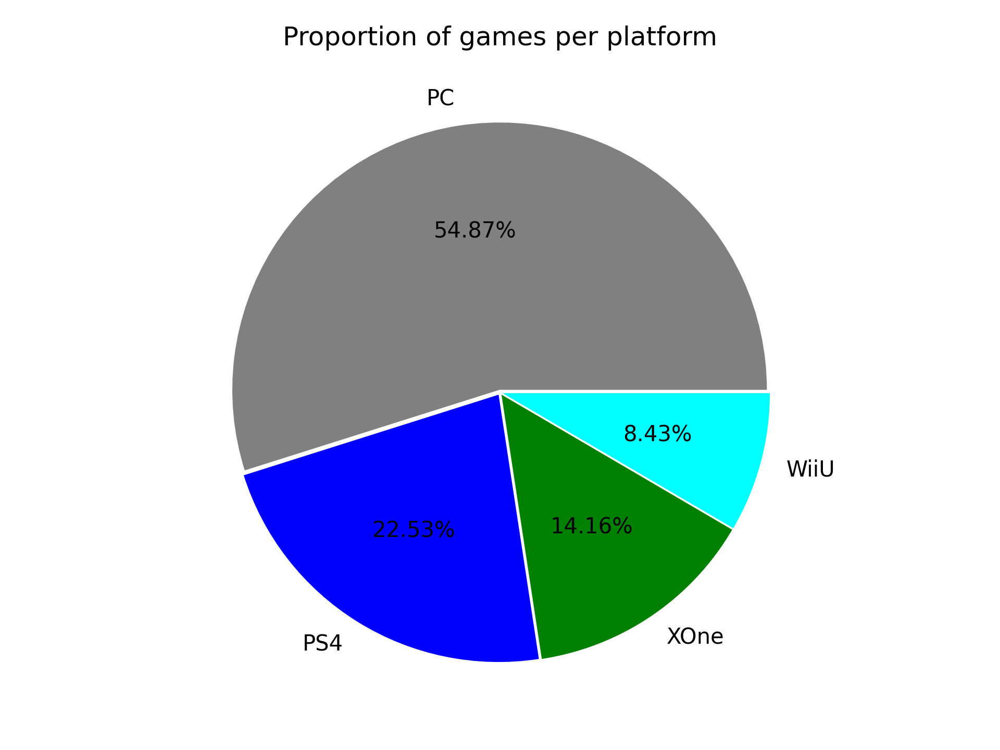

## Theory

Now the figure looks good, but there is still some space for improvements.

First, let's color the wedges with brand colors.
You can do it exactly the same as we did with the bar chart.
But please be aware that for some reason the argument that colors pie chart is called <code>color**s**</code> not `color`!

Second, now the wedges look too packed. It would be nice to have a little space between them.
For that, we can use the `explode` argument.
It accepts a collection of floats that specify the fraction of the radius with which to offset each wedge.

Finally, let's add a title to our figure and tighten its layout.

## Task

1. Color the wedges in the following way: `PC` with `grey`, `PS4` with `blue`, `XOne` with `green`, `WiiU` with `cyan`.
2. Offset each wedge to `0.01`.
3. Set the figure title to `Proportion of games per platform`

## Hints

    To set a title for a figure, you can use the <code>set_title</code> method of the <code>Figure</code> object:
    <code>fig.set_title("Title")</code>.

   

