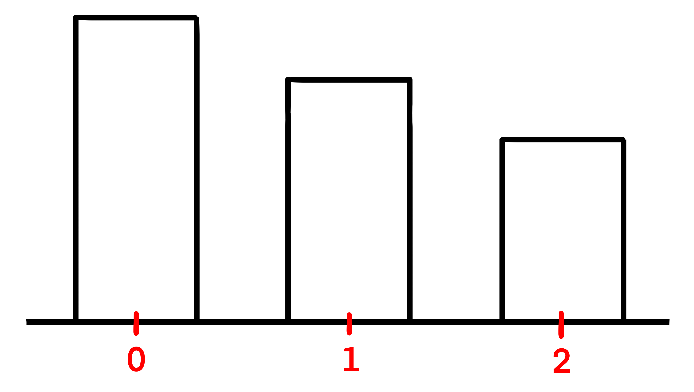
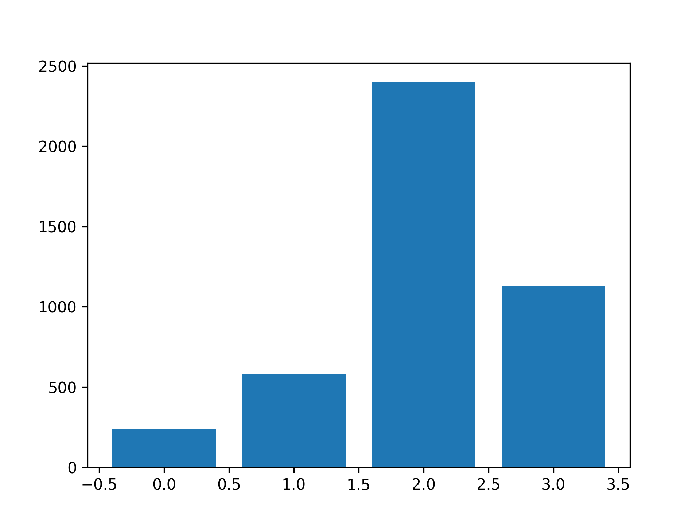

## Theory

For now, we only built a simple bar chart, but sometimes it is necessary to plot several traces on the same chart.
For example, if we want to compare total sales over decades per region.

`bar` allows you to manually build bars where needed.
For example, if we pass `range(3)` as x-axis and `[5, 4, 3]` as heights, the result would be something like this:

As you can see, `bar` placed the first bar at 0, the second one at 1 and the last one at 2.

As for our figure, we will have several groups (decades) and for each group we will plot several traces (regions).
So let's start with the simple task!

## Task

1. Using the hidden `aggregate` function calculate the total sales (`sales`) over decades (`decade`) per region (`region`).
   
   If you prefer, you can do it yourself. Please refer to the corresponding hints below.

2. Implement the `plot_region` function. It should plot total region sales over decades like in the example.

   You can use the hidden `get_number_of_decades` for calculating the total number of decades 
   and the `get_region_sales` for getting sales data only for a specified region.

   If you prefer, you can do it yourself. Please refer to the corresponding hints below.

   Please note that you don't need the trace argument for now.

3. Using the `plot_region` function plot the total sales for the North America (`na`) region.

## Hints

   To calculate the number of decades you could use the <a href="https://pandas.pydata.org/docs/reference/api/pandas.DataFrame.nunique.html"><code>nunique</code></a> function on the <code>decade</code> column.

   To get only the region sales use the <a href="https://pandas.pydata.org/pandas-docs/version/1.0/getting_started/intro_tutorials/03_subset_data.html#how-do-i-filter-specific-rows-from-a-dataframe">bracket notation</a> with the condition on the <code>region</code> column.

   

