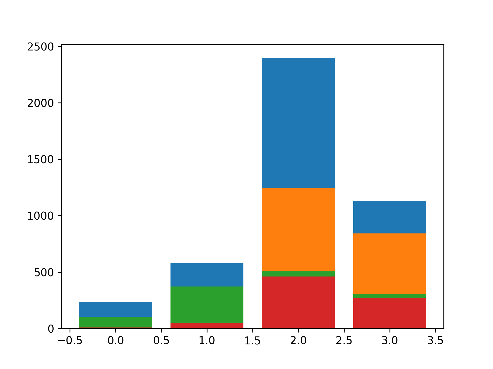

## Theory

For now, we have only one region, so let's add more!

## Task

Plot sales for each region using the `plot_region` function. The required region order is `['other', 'jp', 'na', 'eu']`.

## Hints

   

