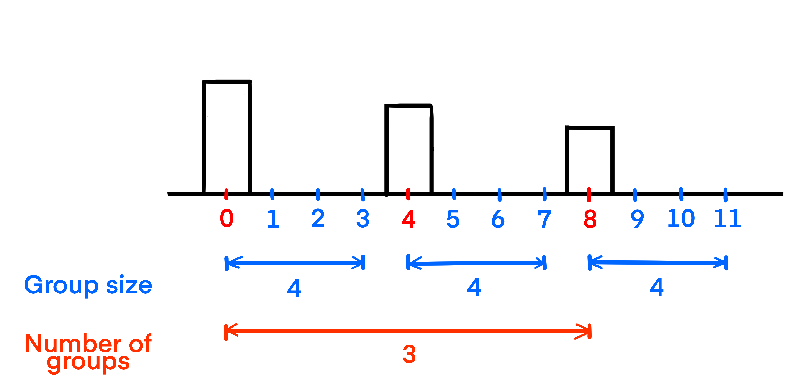
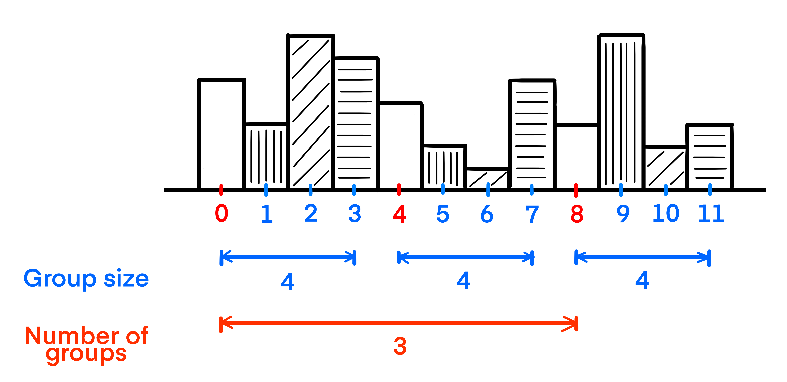
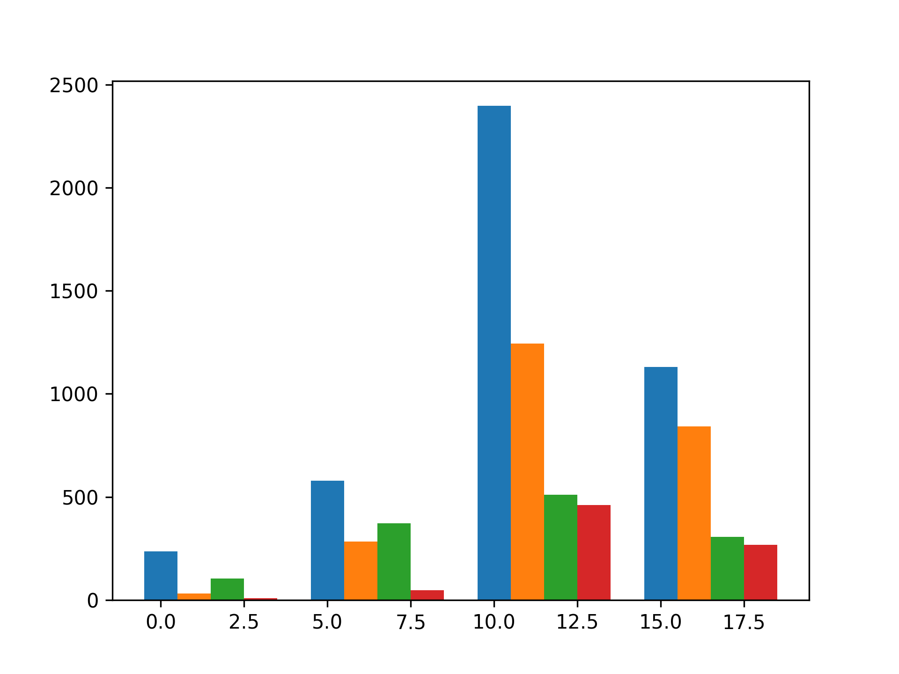

## Theory

As you can see, something is definitely changed on our figure: we plotted several traces but can see only one.
This happened because we plotted them on the same x-axis coordinates and one of them overlapped with all the rest.

To fix this, we need to increase the distance between decades to fit every region.

For example, if we have 3 groups, each of sizes equal to 4,
then we need to have a distance equal to 4 to fit every region data:

However, if we do this, we would see that there is no space between each group:

To fix this, we should increase the size of the group artificially by a unit:

So the result distance will be 5.

Also, an important thing to note is the width of each bar should be equal to 1, so there won't be any space between
bars.
To achieve this, we could use the `width` argument.

## Task

Modify the `plot_region` function, so it would plot each region data in the distance and use the `trace` argument to
shift each region trace.

The required region order is `['other', 'jp', 'na', 'eu']`.

## Hints

   

