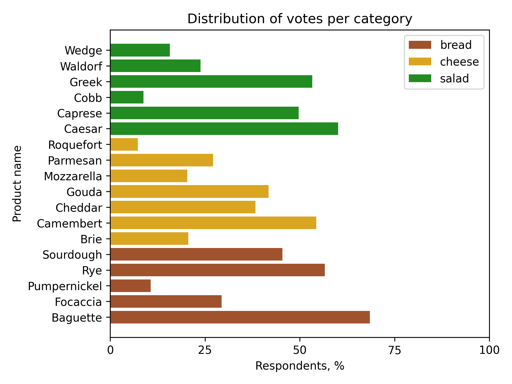

## Task

At a recent tasting event, participants were invited to sample an assortment of breads, cheeses, and salads.
Everyone had the chance to vote for up to 3 products per category, sharing their favorites among the diverse offerings.
The organizers of a tasting event received all the responses,
calculated themselves the percentage of votes for each product in each category
(so that they know the corresponding distribution along cheese, bread, and salad).
Now they want us to help with plotting the data.
Let's help them!

To interpret the data,
the organizers want to see the distribution of votes (`votes`) for each category (`category`) in a single horizontal bar chart.
So you should plot categories from bottom to top as follows: `bread`, `cheese`, and `salad`.

The other requirements are:

1. The bars should be colored as follows: `bread` - `sienna`, `cheese` - `goldenrod`, `salad` - `forestgreen`.
2. Each bar should have the corresponding product name on the left side of the bar (i.e. `cheddar`).
3. Set the y-axis label as `Product name`.
4. Limit the x-axis view to the interval from `0` to `100`.
5. The x-axis should have only these ticks: `0`, `25`, `50`, `75` and `100`.
6. Set the x-axis label as `Respondents, %`.
7. Set the chart title as `Distribution of votes per category`.
8. Add the legend.
9. Tighten the layout.

Note that you don't need to preprocess the data.

You could also use the following hidden function:
1. `get_category_votes` to get all votes for the specific category.
2. `get_category_product_names` to get all product names for the specific category.
3. `get_category_size` to get a number of products in the specific category.
4. `get_categories` to get a list of categories.

If you get stuck, please feel free to use the hints below, where you can also find what the final figure should look
like.

## Hints

    

    To set the colors for the bars, you can use the <code>color</code> argument of the <code>ax.barh</code> method:
    <code>ax.barh(positions, values, color="red")</code>

    To set the labels for the products, you can use the <code>ax.set_yticks()</code> method:
    <code>ax.set_yticks([1, 2, 3], ["cucumber", "carrot", "tomato"])</code>

    To limit the x-axis view, you can use the <code>set_xlim</code> method:
    <code>ax.set_xlim(1, 3)</code>.

    To set ticks for the x-axis, you can use the <code>set_xticks</code> method:
    <code>ax.set_xticks([1, 2, 3])</code>.

    You can use the <code>set_xticks()</code> method with an empty list to remove the x-axis ticks.

    To set the figure title, you can use the <code>set_title</code> method:
    <code>ax.set_tile("Title")</code>.

    To add a legend, you should call the <code>ax.legend</code> method.

    To tighten the layout, you should call the <code>fig.tight_layout</code> method.

