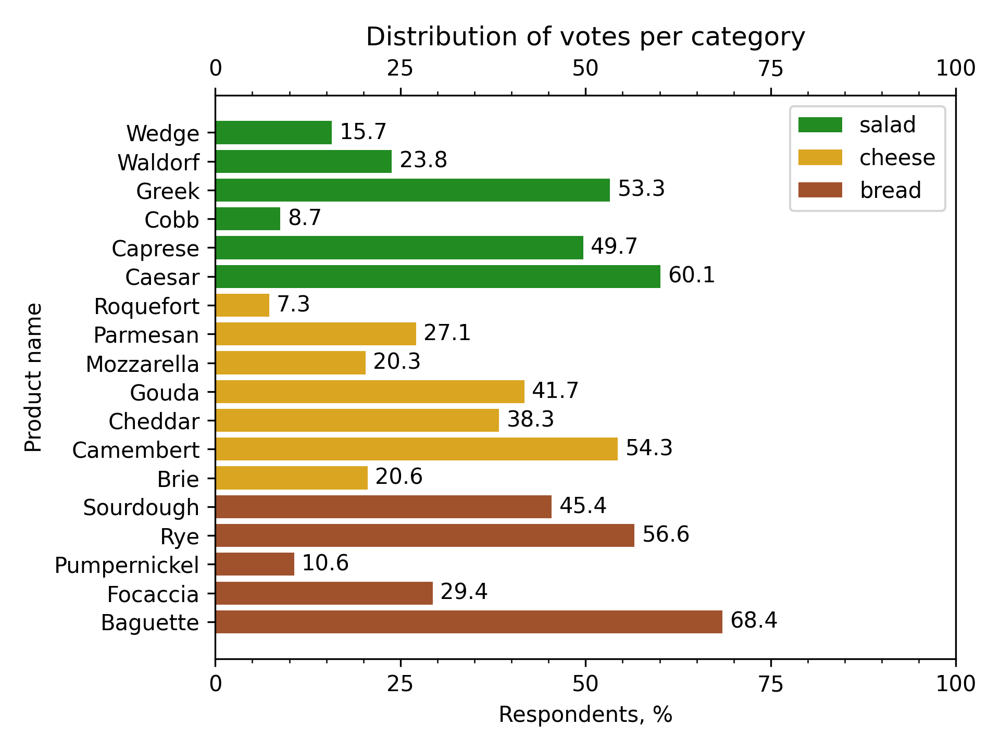

## Task

The organizers liked our figure, but they asked us to make it more readable.
To be precise, they don't like that it is hard to find the exact value for each product 
and that the legend items are located in the reverse order.
Let's fix it!

First, let's add minor ticks to our bottom x-axis and duplicate all ticks to the top spine:
1. To add minor ticks, you could use
   the familiar [`ax.set_xticks`](https://matplotlib.org/stable/api/_as_gen/matplotlib.axes.Axes.set_xticks.html) method.
   Distribute them from `0` to `100` with step `5`.
2. To duplicate the bottom ticks to the top, you could use
   the [`ax.tick_params`](https://matplotlib.org/stable/api/_as_gen/matplotlib.axes.Axes.tick_params.html) method.

Second, let's add a textual value for each product.
You can use the [`ax.text`](https://matplotlib.org/stable/api/_as_gen/matplotlib.axes.Axes.text.html) method to do it.
They should be located to the right of the top of each bar
(the `x` coordinate should be `1` more than the number of participants, and `y` should match the position of the bar).
The value should be round up to one digit after the decimal point.

And last thing: to rearrange legend items, we can use
the [`ax.get_legend_handles_labels`](https://matplotlib.org/stable/api/_as_gen/matplotlib.axes.Axes.get_legend_handles_labels.html) method
along with [`ax.legend`](https://matplotlib.org/stable/api/_as_gen/matplotlib.axes.Axes.legend.html).

Please consult the corresponding documentation pages to figure out how to do it.

If you get stuck,
please feel free to use the hints below, where you can also find what the final figure should look like.

## Further customization

If you want, you can further customize the figure. Here are some ideas for the customization:

1. Change font weights and sizes.
2. Move legend items to the y-axis.
3. Plot categories on the different axes within the same figure.

We encourage you to explore these customizations on your own, as not all of them will be covered in the course.

Note that these changes will not be tested and might break existing tests.

## Hints

    

    To add the minor ticks, you can use the <code>ax.set_xticks</code> method with the <code>minor</code> argument:
    <code>ax.set_xticks([1, 2, 3], minor=True)</code>.

    To add the ticks to the top spine, you can use the <code>ax.tick_params</code> method:
    <code>ax.tick_params(top=True, labeltop=True, axis="x", which="both")</code>.

    To add a textual value for each product, you can use the <code>ax.text</code> method
    along with the <code>round</code> function for value formatting:
    <code>ax.text(value + 1, bar_y_position, f"{round(value, 1)}", verticalalignment="center")</code>.  
    Note that we use the <code>verticalalignment</code> argument here to properly align the text.

    To get a list off the layout handles and labels, you can use the <code>ax.get_legend_handles_labels</code> method:
    <code>handles, labels = ax.get_legend_handles_labels()</code>.  
    After that, we can pass the reversed values to the <code>ax.layout</code> method:
    <code>ax.layout(reversed(handles), reversed(labels))</code>

