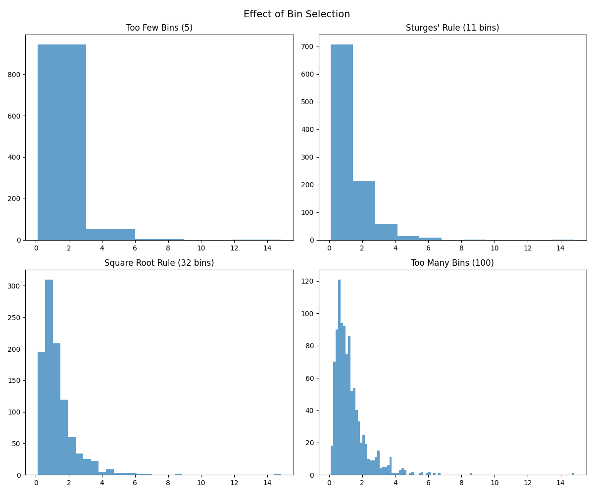

# Choosing the Right Number of Bins

One day, while analyzing annual rainfall patterns, Andy noticed something odd - his histogram looked completely different from his colleague's, even though they were working with the same data! The culprit? They had chosen different numbers of bins for their histograms.

## The Histogram Dilemma

The number of bins in a histogram significantly affects its interpretation. Too few bins might hide important patterns, while too many bins can make the visualization noisy. Andy learned this the hard way when his initial analysis missed an important bi-modal pattern in rainfall distribution that could have helped predict flood seasons better.

## Common Methods for Bin Selection:

1. **Sturges' Rule** (1926)
   - Number of bins = 1 + log₂(n)
   - Where n is the number of observations
   - Works well for normal distributions
   - Less effective for skewed data
   - Developed by Herbert Sturges, who first published this rule in the Journal of the American Statistical Association

2. **Freedman-Diaconis Rule** (1981)
   - Bin width = 2 × IQR × n^(-1/3)
   - IQR is the interquartile range
   - More robust to outliers
   - Better for non-normal distributions
   - Created by David Freedman and Peter Diaconis as an improvement over Sturges' rule

3. **Square Root Rule**
   - Number of bins = √n
   - Simple but effective
   - Popular in many statistical software packages
   - Often called the "quick and dirty" method by statisticians

## Andy's Discovery

After experimenting with different bin selection methods, Andy found that the Freedman-Diaconis rule worked best for his rainfall data. It revealed a subtle pattern: there were actually two peak rainfall seasons in his region, something that had been obscured when using too few bins. This discovery led to better flood prediction models and helped local farmers plan their planting seasons more effectively.

## The Art and Science of Bin Selection

The choice of bins can reveal or hide features in your data:
- Too few bins: Might miss important patterns, like Andy's initial analysis
- Too many bins: Can make the data look noisy and difficult to interpret
- Just right: Shows the true shape of the distribution 

## Historical Note

The concept of histograms dates back to Karl Pearson in 1891. However, the challenge of optimal bin selection has been a topic of ongoing research for over a century. Each method we use today was developed to address specific limitations of previous approaches:

- 1926: Sturges' rule introduces the first formal method
- 1979: Scott's normal reference rule emerges
- 1981: Freedman-Diaconis rule revolutionizes the field
- Modern era: Machine learning algorithms beginning to tackle this classic problem

Remember: There's no one-size-fits-all solution. The best method often depends on your specific data and goals, just as Andy discovered with his rainfall analysis. 