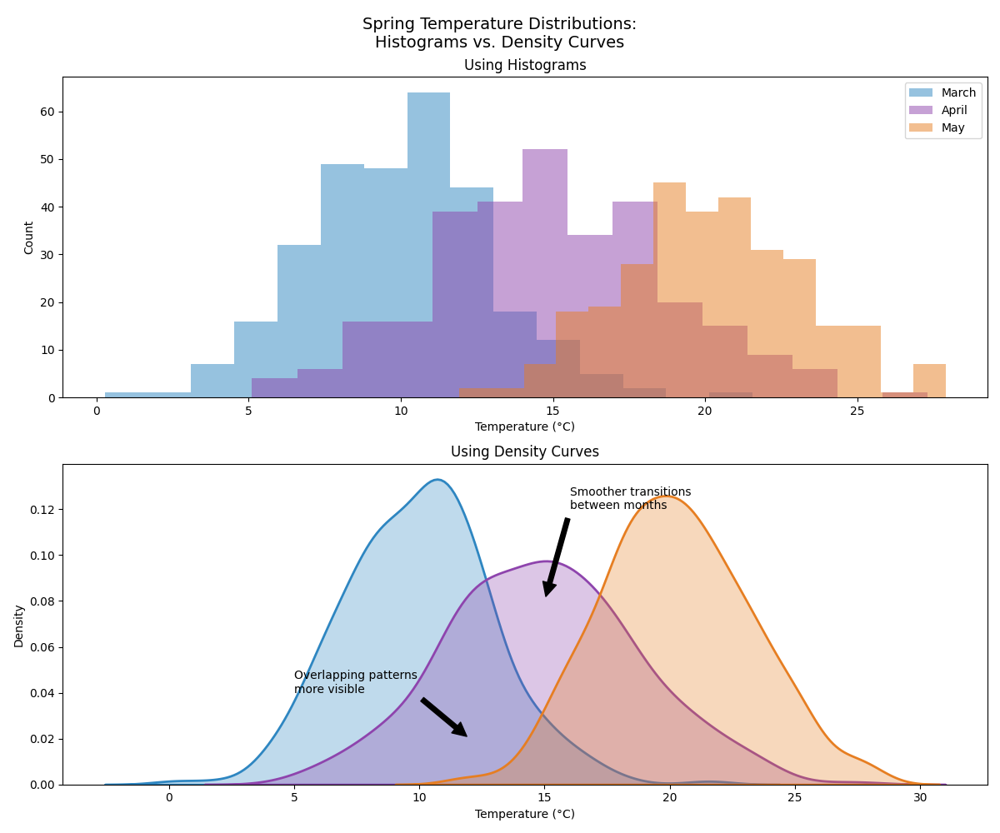

# From Bars to Curves: Understanding Density Plots

After working with histograms for a while, Andy noticed their limitations. The abrupt jumps between bars sometimes made it hard to see smooth trends in temperature changes. His mentor introduced him to density curves - a smoother, more continuous way to view distributions.

## Andy's Spring Temperature Challenge

One March morning, Andy's supervisor asked him to analyze how temperatures changed throughout spring. Using histograms, the patterns were choppy and unclear. But when he switched to density curves, everything became clearer:

- The smooth overlapping curves showed gradual warming
- Areas where temperatures overlapped between months became obvious
- The transition from winter to spring temperatures was clearly visible
- The varying spread of temperatures in each month was easy to spot

## Why Use Density Curves?

1. **Smoother Visualization**
   - No arbitrary jumps between bars
   - Easier to compare multiple distributions
   - Better for spotting subtle patterns
   - Perfect for continuous data like temperature

2. **Area Properties**
   - Total area always equals 1
   - Height shows relative likelihood
   - Area between points shows probability
   - Overlapping regions show shared values

3. **Practical Benefits**
   - Less sensitive to bin width choices
   - Better for comparing groups
   - Easier to overlay multiple distributions
   - Clearer visualization of trends

## Real-World Applications

Andy found density curves particularly useful for:
- Tracking seasonal temperature transitions
- Comparing weather patterns across years
- Identifying climate change trends
- Communicating weather forecasts to the public

## The Math Behind the Curves

The smooth curves come from a technique called kernel density estimation:
1. Place a small "bump" (kernel) at each data point
2. Add up all the bumps to create a smooth curve
3. Adjust the kernel width (bandwidth) to control smoothness
