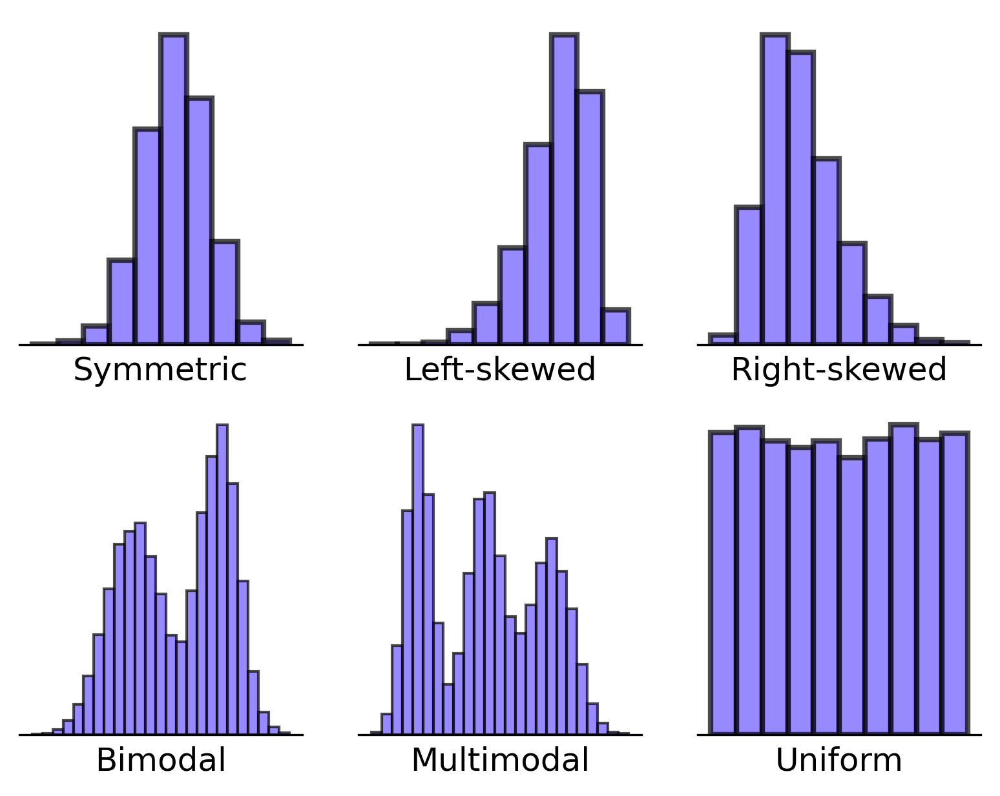

# Common Distribution Shapes

After mastering basic histograms, Andy faced a new challenge: understanding what different distribution shapes meant for weather patterns. His mentor explained that certain shapes appear frequently and each tells a different story about the data.

## The Shapes in Andy's Data

1. **Normal (Bell Curve)**
   - Andy found this in summer temperatures
   - Symmetric around the mean
   - Most days cluster around average temperature
   - Fewer extremely hot or cold days
   - First described by Carl Friedrich Gauss in the 1800s

2. **Skewed**
   - Rainfall showed this pattern
   - Right-skewed: Many light rains, few heavy storms
   - Left-skewed: Rare in weather, but common in other fields
   - First studied systematically by Karl Pearson in 1895

3. **Uniform**
   - Andy saw this in artificially controlled greenhouse temperatures
   - All values equally likely
   - Rare in nature, common in human-controlled systems
   - Important in statistical theory and random number generation

4. **Bimodal**
   - Appeared in Andy's annual temperature data
   - Two distinct peaks showing summer and winter patterns
   - Helped predict seasonal transitions
   - First noted in weather patterns by meteorologist Luke Howard in 1818

## Real-World Applications

Andy's discoveries helped him:
- Predict flood risks from skewed rainfall patterns
- Plan maintenance around bimodal temperature patterns
- Identify faulty sensors when uniform patterns appeared unexpectedly

## Why Shapes Matter

Understanding these patterns helped Andy make better decisions about:
- Weather warnings (identifying unusual patterns)
- Equipment maintenance (preparing for extreme conditions)
- Long-term climate analysis (detecting pattern changes)
- Sensor calibration (spotting mechanical issues)

Remember: Every shape tells a story. Learning to read these stories made Andy a better meteorologist!