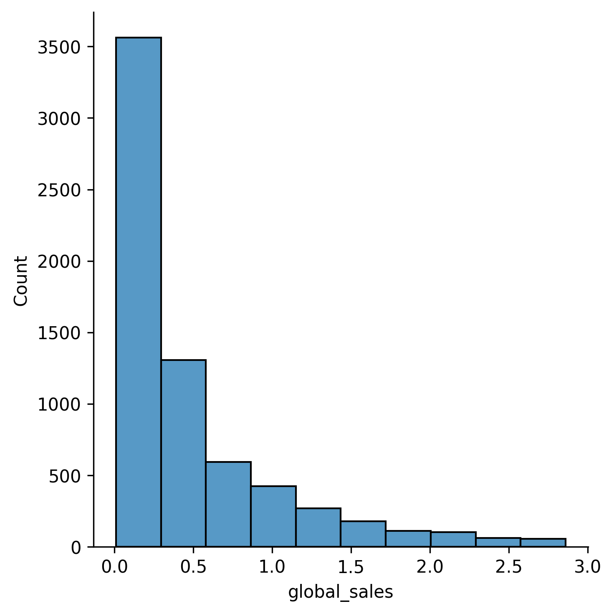

## Theory

Our histogram now provides a clearer view of the distribution, but it may still be too detailed. When using many bins,
small fluctuations in the data can create a noisy appearance, making it harder to see overall trends.

The number of bins determines the balance between detail and smoothness:

- Too many bins: Reveals fine details but introduces noise.
- Too few bins: Smooths the data but may hide important patterns.
- Just right: Preserves key trends while reducing unnecessary noise.

By default, Seaborn uses the minimum of the bin width according to
the [Sturges's rule](https://en.wikipedia.org/wiki/Sturges%27s_rule)
and [Freedman-Diaconis rule](https://en.wikipedia.org/wiki/Freedman%E2%80%93Diaconis_rule) to choose the number of bins.
However, we can manually set the desired number of bins in `bins` argument of the `displot` function.

## Task

Create the same histogram as before with `10` bins.

Please do not forget to filter dataset by global sales below 95th percentile, as in the previous task.

## Hints

    

