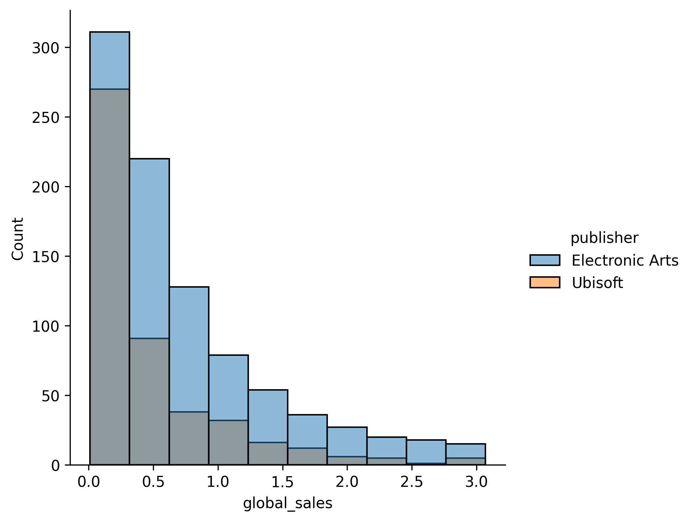

## Theory

Great! Now our histogram clearly shows the key pattern: there are far fewer games with high sales than those with low
sales. Next, let’s use histograms to compare distributions. Now we will compare the sales distributions of
games from different publishers.

Seaborn's `displot` allows plotting multiple distributions on the same figure in several ways:

1. Overlaid on the same axis with transparency.
2. Stacked on top of each other.
3. Separated into subplots for each distribution.

We will focus on overlaid histograms, as they are great for direct comparisons. To achieve this, we can use the `hue`
argument to split the data by a categorical column.

## Task

Use the hidden `filter_by_publisher_and_global_sales` function to get distributions for `Ubisoft` and `Electronic Arts`
publishers below the 95th percentile.

Pass the `publisher` column to the `hue` argument to distinguish the distributions. Do not change the number of bins.

If you prefer, you can filter the dataset manually. Please refer to the corresponding hint below.

## Hints

    You have to filter by 2 columns:
    <ol>
    <li>Use boolean indexing and <a href="https://pandas.pydata.org/docs/reference/api/pandas.Series.isin.html#pandas.Series.isin"><code>isin</code></a> function on <code>publisher</code> column.</li>
    <li>Filter the data by global sales below 95th percentile.</li>
    </ol>

   

