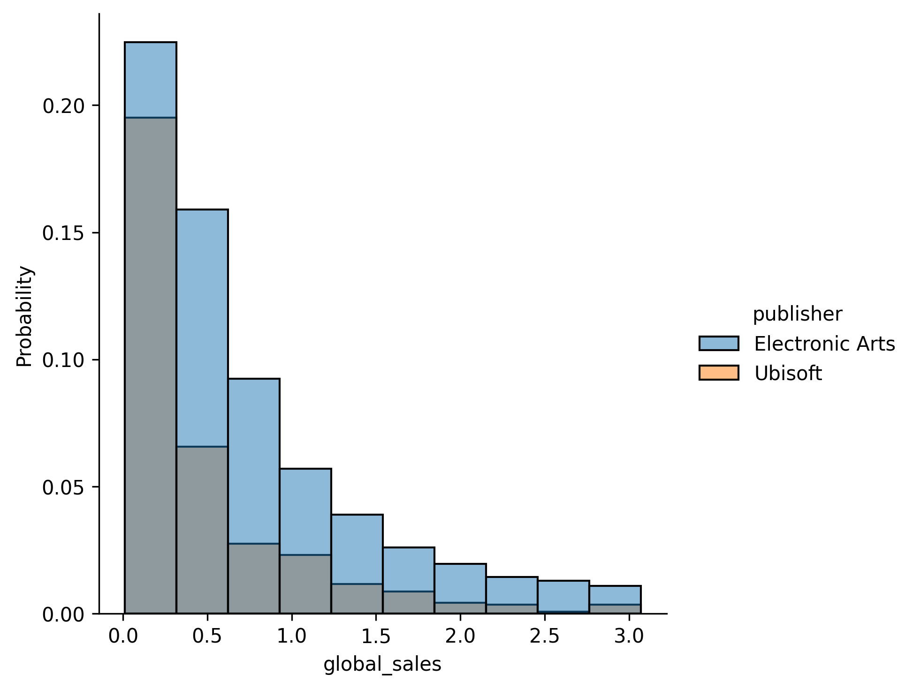

## Theory

When comparing distributions with different sample sizes, using raw counts can be misleading. For example, if one publisher has released significantly more games than another one, its bars will naturally be higher even if the distribution is the same.

To address this, we can normalize histograms so they show proportions (or probabilities) instead of raw counts. This ensures that differences in sample size do not affect the histograms.

In Seaborn's `displot`, we can do this by setting the `stat` parameter to:
- `'count'` (default) – Displays the number of observations in each bin.
- `'probability'` – Shows the proportion of observations in each bin (summing to `1`).
- `'density'` – Similar to `'probability'`, but the total area under bars equals `1`.
- `'frequency'` – Like `'count'`, but normalized by bin width.

## Task

Modify your previous histogram to show probabilities instead of counts. Keep all other parameters the same:
- Filter for `Unisoft` and `Electronic Arts`.
- Include only games below the 95th percentile of sales.
- Use `10` bins.

## Hints

   

