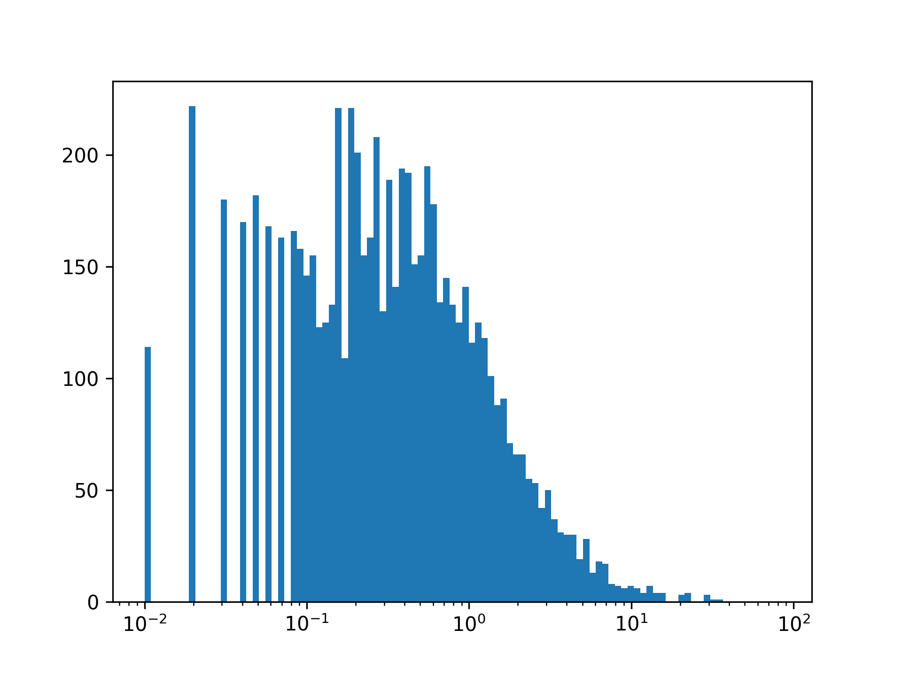

## Theory

At this point, our histogram looks quite unusual — a large square with a small bin next to it is definitely not what we
expected. This happens because applying a logarithmic scale only stretches the axis, but does not modify the bins
themselves. The bin sizes remain unchanged, leading to a distorted visualization.

To fix this, we need to manually configure the bins using the `bins` argument in the `hist` function. This argument accepts:

- An integer: The number of bins to use.
- A collection: The edges of the bins (supports non-uniform widths).
- A string: The method to calculate the number of bins. To see the list of accepted strings
  check [documentation](https://numpy.org/doc/stable/reference/generated/numpy.histogram_bin_edges.html).

By default, Matplotlib sets the number of bins to `10`. 

## Task

Plot a histogram with `100` logarithmic bins.

Use the hidden `get_logarithmic_bins` function to get logarithmic bins for the histogram. Pass the dataset and the number of bins as arguments.

If you prefer, you can generate bins manually. Please refer to the corresponding hint below.

## Hints

    

    To import it, you can place the cursor on the underlined hidden function name in your code, then press &shortcut:ShowIntentionActions;, and
    select <samp>Import 'function_name from data'</samp>:
    

    One way to generate logarithmic bins is to define bins as a collection of logarithmically uniform numbers, using <a href="https://numpy.org/doc/stable/reference/generated/numpy.logspace.html"><code>np.logspace</code></a> function. It accepts the following arguments:
    <ul>
        <li><code>start</code>: The starting point of the sequence.</li>
        <li><code>stop</code>: The end point of the sequence.</li>
        <li><code>num</code>: The number of samples to generate.</li>
        <li><code>base</code>: The base of the logarithm.</li>
    </ul>
    For example, <code>np.logspace(0, 3, 4, base=10)</code> will generate 4 numbers from \(10^0\) to \(10^3\). 
      
    Let <code>base</code> be <code>10</code> (the default value). 
    Please note, that as <code>start</code> you have to pass the logarithm of the minimum value in the dataset, the
    same goes for the <code>stop</code> argument. Do not forget, that you generate bins edges, so the number of edges is the number of bins <code>+ 1</code>.

