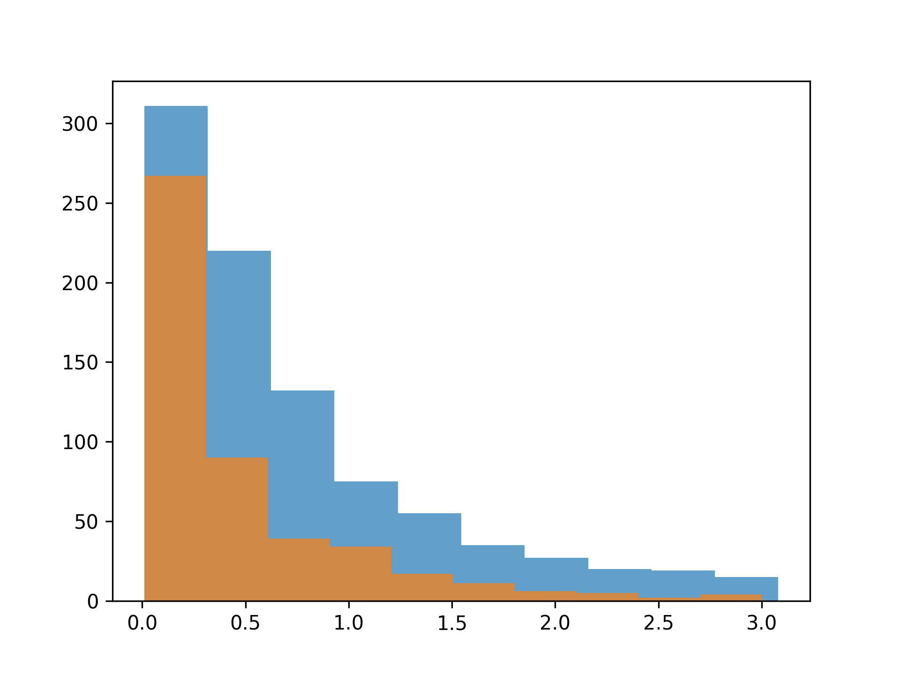

## Theory

Great! Now our histogram clearly shows the key pattern: there are far fewer games with high sales than those with low
sales. Next, let’s use histograms to compare sales distributions from different publishers.

Matplotlib's `hist` allows plotting multiple distributions on the same figure in several ways:

1. Overlaid on the same axis with different transparency.
2. Stacked on top of each other.
3. Separated into subplots for each distribution.
4. Grouped histograms. Unlike overlaid ones, bins are placed next to each other rather than overlapping.

We will focus on overlaid histograms, as they are great for direct comparisons. To achieve this, we can plot histograms
one at a time, calling `hist` for each distribution.

## Task

Plot two overlaid histograms for the global sales distributions of games published by `Electronic Arts` and `Ubisoft`.

For each histogram set `alpha` as `0.7`, keep the default value for `bins`. We described `alpha` parameter in details in
the "[Transparency and color](course://1_2_line_and_scatter_plots_matplotlib/1_theory/2_transparency_and_color)"
section. See more details in the corresponding hint below.

Use the hidden `filter_by_publisher_and_global_sales` function to retrieve the global sales data for the given publisher,
filtering out values above the 95th percentile. Pass the dataset and the publisher name as arguments.

If you prefer, you can filter the dataset manually. Please refer to the corresponding hint below.

## Hints

    You have to filter by two columns:
    <ol>
    <li>Use boolean indexing on <code>publisher</code> column.</li>
    <li>Filter the data by <code>global_sales</code> below 95th percentile.</li>
    </ol>

    Specify the <code>alpha</code> parameter in <code>hist</code> function.

   

