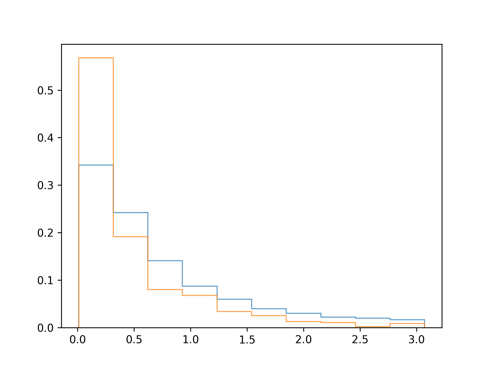

## Theory

Our histogram now looks better, but there are still some refinements we can make.

1. Ensure equal bins for both distributions – This allows for a more accurate comparison.
2. Improve visual clarity by adjusting the `histtype` parameter in the `hist` function.

By default, `histtype` is set to `'bar'`, which fills the bars with color. However, we can change it to `'step'`, which
draws a line connecting the tops of the bars while leaving the area unfilled. This creates a cleaner and more
visually appealing distribution.

## Task

Modify the histogram as follows:
- Set `histtype` to `'step'` to create an unfilled line-based histogram.
- Generate the same bins collection for both distributions. There should be `10` uniform bins, starting from the minimum global sales value (across both publishers) and ending at the maximum value.

You can retrieve the minimum and maximum values using the `get_min_sales` and `get_max_sales` functions.

If you want, you can find these values manually. Please refer to the corresponding hint below.

## Hints

    First, filter the dataset to include only global sales data for <code>Electronic Arts</code> and <code>Ubisoft</code> below 95th percentile. 
    Then, extract the minimum and maximum values from the <code>global_sales</code> column using the 
    <a href="https://numpy.org/doc/stable/reference/generated/numpy.min.html#numpy.min"><code>min</code></a> and 
    <a href="https://numpy.org/doc/stable/reference/generated/numpy.max.html#numpy.max"><code>max</code></a> functions.

   

