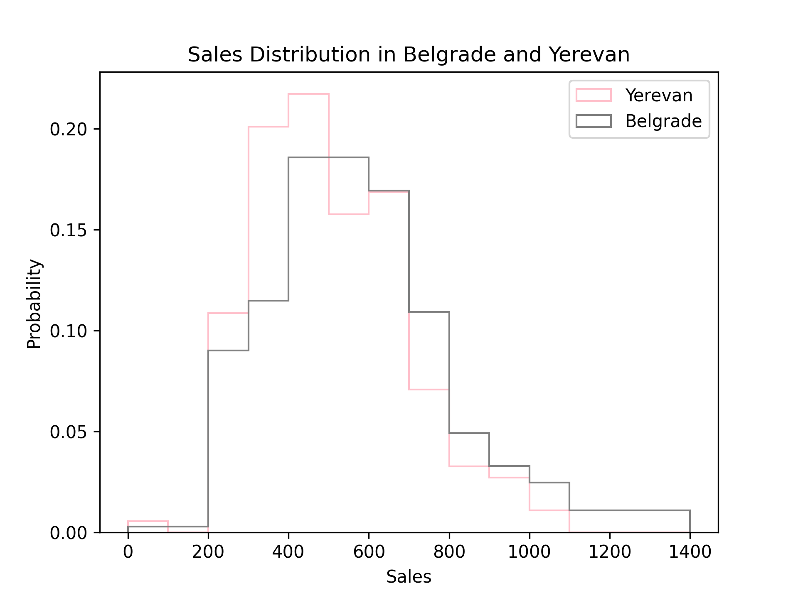

## Task

A beverage company has been successfully operating in Belgrade, selling a variety of drinks throughout the year. Now,
they have decided to expand their business to Yerevan and want to compare their established sales in Belgrade with the
initial six months of sales in Yerevan to assess market differences and optimize their strategy.

Because the two markets differ in size, seasonality, and customer preferences, the company wants to see if Yerevan’s
sales patterns, despite the shorter observation period, resemble those in Belgrade. If both follow a similar
distribution, it might suggest that the factors influencing sales are consistent across cities. If not, there could be
unique local influences at play.

To reveal these overall trends, the company asked us to create a single plot with two overlapping histograms.

Visualization requirements:

1. The histogram should be normalized (the bins should sum to `1`).
2. The histogram should be an unfilled line plot.
3. Yerevan data should be colored `crimson` and Belgrade data should be colored `black`.
4. Both histograms should have common bins, ranging from the lowest rounded-down hundred to the highest rounded-up
   hundred across both cities, with a step of `100`.
5. X-axis label should be `'Sales'`.
6. Y-axis label should be `'Probability'`.
7. Add a title `'Sales Distribution in Belgrade and Yerevan'`.
8. Add a legend with the city names.

Note that there is no need to preprocess the data here.

You can use the following hidden functions:

1. `get_city_sales`: Retrieves sales data for a specific city. Pass the dataset and the city name as arguments.
2. `get_weights`: Retrieves the weights for a specific city.
3. `get_bins`: Retrieves the bin edges for the plot (the same for both cities). Pass the whole dataset as an argument!

If you get stuck, please feel free to use the hints below, where you can also find what the final figure should look
like.

## Hints

    

    To plot two histograms on the same figure, you can call the <code>hist</code> function separately for each city, 
    ensuring both plots share the same <code>ax</code> object.

   To normalize the histogram, you need to set <code>weights</code> parameter of the <code>hist</code> function to 
   \(\frac{1}{n}\) for each city, where <code>n</code> is the number of observations in the city.

   Use <code>histtype='step'</code> in the <code>hist</code> function. This will create an outline-only version of the
   histogram, without any fill.

   If <code>histtype='step'</code> is used, <code>color</code> sets the line color.

   To change it, you can specify <code>bins</code> parameter of the <code>hist</code> function.

   You can pass the desired label to the 
   <a href="https://matplotlib.org/stable/api/_as_gen/matplotlib.axes.Axes.set_xlabel.html#matplotlib.axes.Axes.set_xlabel">
   <code>set_xlabel</code></a> and 
   <a href="https://matplotlib.org/stable/api/_as_gen/matplotlib.axes.Axes.set_ylabel.html#matplotlib.axes.Axes.set_ylabel">
   <code>set_ylabel</code></a> methods: <code>ax.set_xlabel('x')</code> and <code>ax.set_ylabel('y')</code>.

    You can pass the desired title of the plot to the <a href="https://matplotlib.org/stable/api/_as_gen/matplotlib.axes.Axes.set_title.html">
    <code>set_title</code></a> method: <code>ax.set_title("title")</code>.

    First, you should specify the <code>label</code> parameter of the <code>hist</code> function for each city.
    Then, call the <a href="https://matplotlib.org/stable/api/_as_gen/matplotlib.axes.Axes.legend.html">
    <code>ax.legend</code></a> method.

