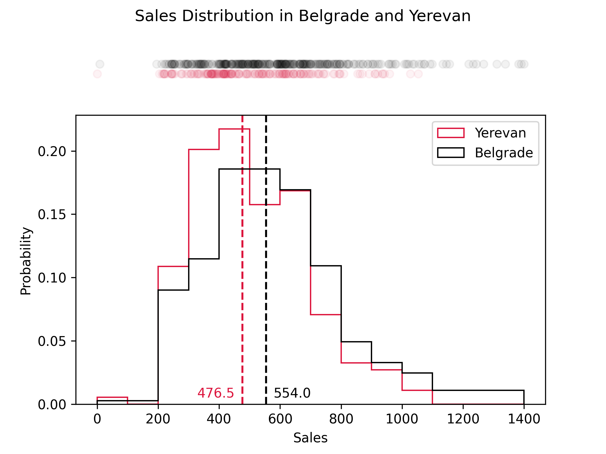

## Task

The company appreciated our initial histogram visualization but now wants deeper insights into their sales data. While
the overlapping histograms provide a good overview of the overall distributions, they are particularly interested in
seeing how individual sales data points are positioned and where each city’s median value lies.

To achieve this, we will enhance our visualization with two main adjustments:

First, let's add a one-dimensional scatter plot above the existing one:

1. Create two `ax` objects using the [
   `plt.subplots`](https://matplotlib.org/stable/api/_as_gen/matplotlib.pyplot.subplots.html) function instead of a
   single one. Set `height_ratios=[1, 10]`.
2. Plot the data points with the [
   `scatter`](https://matplotlib.org/stable/api/_as_gen/matplotlib.axes.Axes.scatter.html#matplotlib.axes.Axes.scatter)
   method on the corresponding `ax` object.
3. Since it is a one-dimensional plot, `y` coordinate should be the same for all points in the same city.
    - Let `y` coordinate for Belgrade sales distribution be `0.2`, and `0.1` for Yerevan distribution.
4. Use the same colors as in the histograms for each city.
5. Set `alpha` parameter to `0.1`.
6. Limit `y` axis range from `0` to `0.3` by calling the [
   `set_ylim`](https://matplotlib.org/stable/api/_as_gen/matplotlib.axes.Axes.set_ylim.html) method.
7. Remove both `x` and `y` ticks.
8. Hide all spines of this plot.

You can use the hidden `get_y_coordinates` function, accepting the city sales and the city name to generate `y`
coordinates for the scatter plot.

Second, let's change the main histograms axes. We will add an edge color for histograms, and add vertical lines with
text labels indicating the median sales value for each city:

1. Add the following edge colors:
    - Belgrade: `crimson`.
    - Yerevan: `black`.
2. Draw a vertical line at each median using [
   `axvline`](https://matplotlib.org/stable/api/_as_gen/matplotlib.axes.Axes.axvline.html) method, on the
   corresponding axes.
3. Make the line dashed, set its width to `1.5`, and match its color to the histogram’s edge color.
4. Use the [
   `text`](https://matplotlib.org/stable/api/_as_gen/matplotlib.axes.Axes.text.html) method to add median value near the
   line:
    - Belgrade: `x = median_belgrade + 25`, `y = 0.005`, horizontal alignment `left`.
    - Yerevan: `x = median_yerevan - 25`, `y = 0.005`, horizontal alignment `right`.
5. Do not include medians in the legend.

You can use the hidden `get_median` function, accepting the city sales to calculate the median sales for each city.

Please consult the corresponding documentation pages to figure out how to do it.

If you get stuck,
please feel free to use the hints below, where you can also find what the final figure should look like.

## Further customization

If you want, you can further customize the figure. Here are some ideas for the customization:

1. Change font weights and sizes.
2. Add minor ticks to the `x` axis of the histograms.
3. Add some jitter for `y` axis of the scatter plot.

We encourage you to explore these customizations on your own, as not all of them will be covered in this course.

Note that these changes will not be tested and might break existing tests.

## Hints

    

    To create two axes, you can use the <a href="https://matplotlib.org/stable/api/_as_gen/matplotlib.pyplot.subplots.html"><code>plt.subplots</code></a> function:
    <code>fig, (ax1, ax2) = plt.subplots(2, 1, height_ratios=[1, 10])</code>.

    You can use Python list operations to make a list of constant values: <code>[1] * 10</code> will create a list of 
    <code>10</code> ones.

    You can remove both <code>x</code> and <code>y</code> ticks by calling the 
    <a href="https://matplotlib.org/stable/api/_as_gen/matplotlib.axes.Axes.set_yticks.html"><code>set_yticks([])</code>
    </a> and <a href="https://matplotlib.org/stable/api/_as_gen/matplotlib.axes.Axes.set_xticks.html"><code>
    set_xticks([])</code></a> methods of axes.

    Call <code>ax_ind.spines[["top", "bottom", "left", "right"]].set_visible(False)</code> one the corresponding <code>ax</code> object.

    Use the <a href="https://pandas.pydata.org/docs/reference/api/pandas.Series.median.html"><code>median()</code></a> 
    method of Series.

    You can set it by passing the <code>edgecolor</code> parameter to the 
    <code>hist</code> function.

    You can get handles and labels of the legend by calling the 
    <a href="https://matplotlib.org/stable/api/_as_gen/matplotlib.axes.Axes.get_legend_handles_labels.html">
    <code>get_legend_handles_labels</code></a> on the corresponding axes. 
    Then, to exclude some elements from the legend you can pass filtered lists of handles and labels to the <code>legend</code> method:
    <code>ax.legend(handles_filtered, labels_filtered)</code>.

