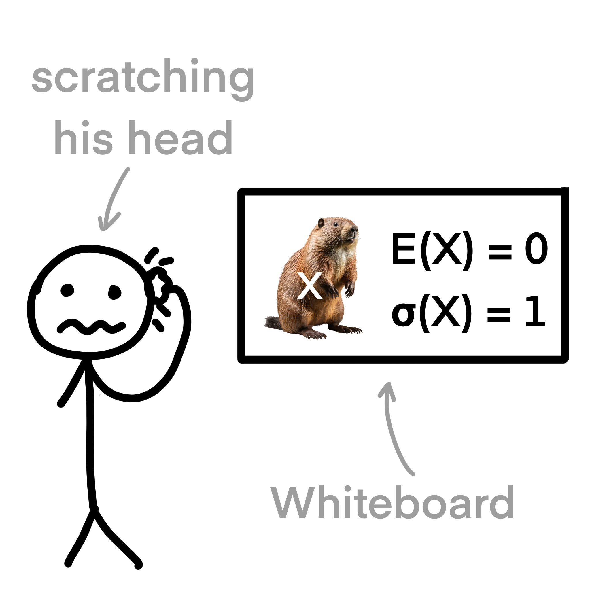

# Data distribution

Bar charts are ideal for comparing the frequency, quantity, or distribution across different categories. They make it
easy to visualize the differences between categories and identify any notable variations. If your data involves discrete
or qualitative variables, a bar chart can offer a clear representation of the differences or similarities between
categories.

