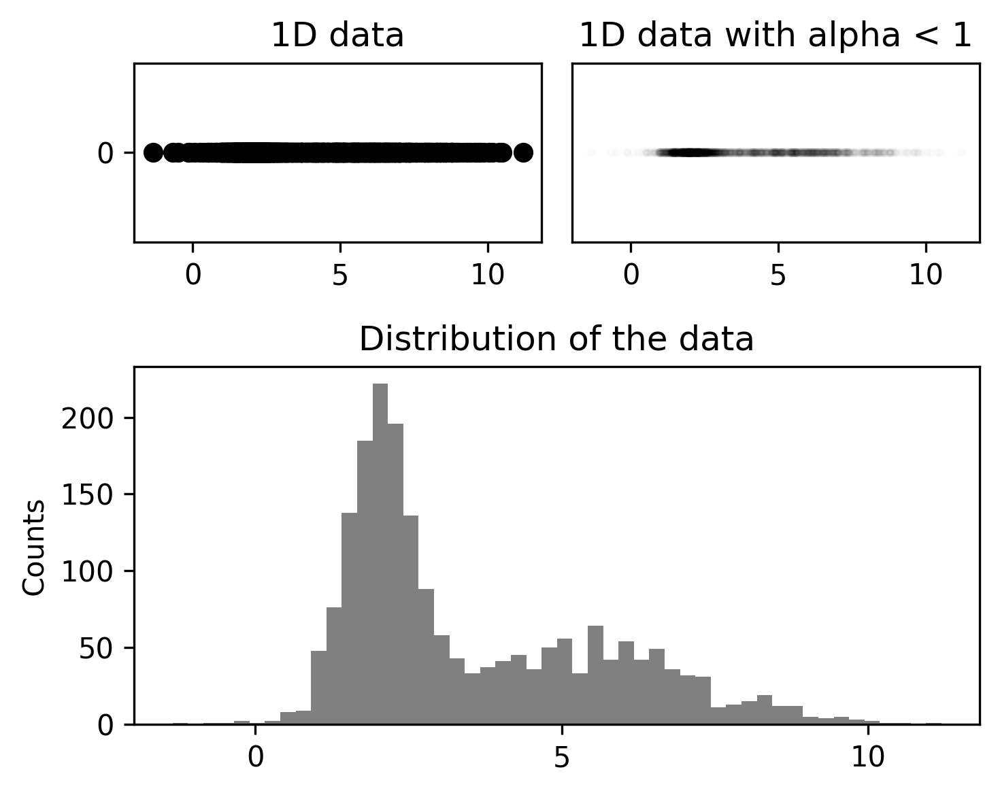

# Relationship between variables

The exploration of data involves the crucial understanding of an aspect known as a 'data distribution'. Very much like a
global map that outlines various countries and continents, a data distribution is a comprehensive representation of your
data dynamics, providing a deep insight into the substance of your data array.

A data distribution is a detailed listing, or more accurately, a function that delineates every possible outcome within
a data set along with the accompanying probability of their occurrence. This representation can take on many forms,
ranging from a symmetrical bell-shaped outline (commonly under the banner of normal distribution) to distributions that
present stretched tails and unequal sides (identified as skewed distributions).

Holding a firm comprehension of data distribution, we require a more visual and decipherable presentation of this
complex structure. And that's where histograms enter the storyline. The process of converting a data distribution into a
histogram is essentially a mechanism that simplifies intricate data sets into more understandable formats.

The simple methodology associated with a histogram involves partitioning your whole data range into certain sections or
intervals. The next step is to ascertain the count of data points that are housed within each interval. This process
yields a graphical representation characterized by vertical bars, where the height of each bar signifies the frequency
of data in each corresponding interval.

In conclusion, navigating through the realm of data distribution and translation into a histogram is a significant phase
in understanding and analyzing data. Like every intricate process, the specifics and minor details hold immense
importance, forming an essential part of future discussions. For now, this foundation will pave the way for
comprehensive data exploration.

