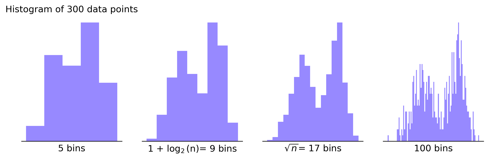

# Histograms Overview

As we already understand, histogram is a great graphical representation of the distribution of the data that provides a
visual interpretation of
numerical data by indicating the number of data points that lie within a range of values. These ranges are known
as `bins` or `buckets`. Histograms have several key elements:

1. **Bins**: These are the ranges of values or intervals. Each bin represents a category that data points can fall into.
   All bins in a histogram are of equal width.

2. **Frequency**: This is the vertical axis, showing the number of observations within each bin.

3. **Data range**: This is the horizontal axis that represents the distribution of values from your data set.

When we talk about bins, it's important to understand how to choose the appropriate number of bins for your histogram.
The process of bin selection can significantly impact the resulting view and interpretation of the data.

Common mistakes include choosing too many bins, which might result in a histogram that appears overly granulated and
possibly dramatizes random variation, or too few bins which can oversimplify your data and obscure useful details.

Choosing the 'right' number of bins isn't an exact science but there are some general rules or guidelines to follow. A
common rule of thumb is to use the square root of the number of data points in the data set. If your data set has 100
observations, the rule suggests you should start with about 10 bins. Another popular strategy is Sturges’ formula which
suggests bin size of 1 + log2(n). More rules on how to choose the best bin number you can on find in
the [Wikipedia page](https://en.wikipedia.org/wiki/Histogram#Number_of_bins_and_width).

However, the best way to determine the appropriate number of bins is often through a process of trial and error,
starting with these suggested values and then making adjustments to maximize coherence and understanding of your data.

It's important to note that histograms are commonly confused with bar charts. In a histogram, each bin represents a
different range of values, cumulatively portraying the distribution of values. On the other hand, in a bar chart, each
bar represents a different category or type of data (e.g., different populations), so they are useful for comparing
various categories. To avoid confusion, many suggest creating gaps between the bars in bar charts, indicating clearly
that they are not histograms.

To conclude, remember to consider the nature of your data, the purpose of your analysis, and your audience's
understanding
and level of expertise. Making the right choice can help you clearly illustrate trends, patterns, and outliers in your
data, leading to more accurate data analysis and visual storytelling.

