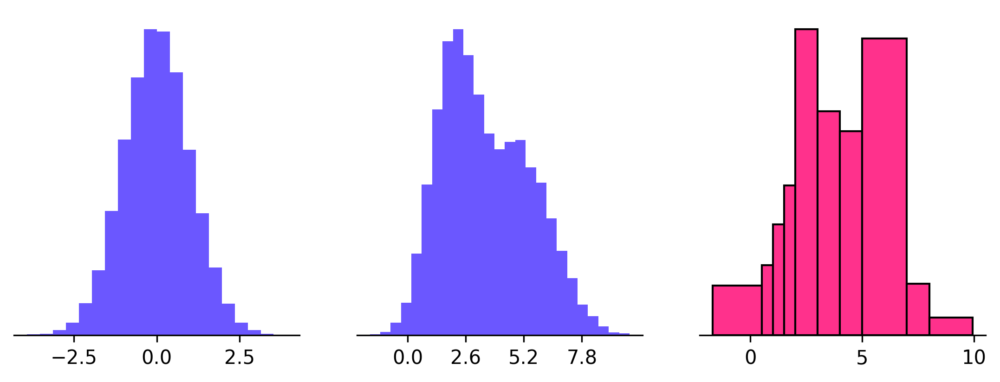

# The Best and... not the best practices

Using histograms effectively can greatly enhance your data visualization and analysis. But to do this successfully, you
need to mind certain good and bad practices.

Good practices start with choosing interpretable bin boundaries. Labels and tick marks situated on the bin boundaries
greatly enhance the clarity of the histogram as they provide a clear demarcation of where each bar's limit lies. Labels
need not be attached to every bar - positioning them at every few bars works just as well in keeping track of values.
Also, labels should ideally have fewer significant figures to promote easy readability.

The next aspect to consider in good histogram plotting practices is the types of values your variables take. If your
variable only takes integer values, using fractional bin sizes, such as 2.5, could make your histogram look unusually "
bumpy". This can be circumvented by carefully considering the bin sizes that capture integer outcomes effectively.

Another pitfall to avoid is using unequal bin sizes. While it's technically possible, it can complicate the
comprehension and interpretation of the histogram. If bins are of unequal sizes, the frequency density per unit should be
encoded into the vertical axis, a task that is often challenging to execute and interpret.

Therefore, the smartest way forward would be to retain uniform bin sizes. This will make your histogram more
interpretable, even if some data ranges appear sparse or noise increases. Should there be certain aspects of your
variable that suggest uneven bin sizes, then instead of an uneven-bin histogram, it would be more pragmatic to use a bar
chart. By understanding and applying these practices, you can produce meaningful and correct histograms.
 
