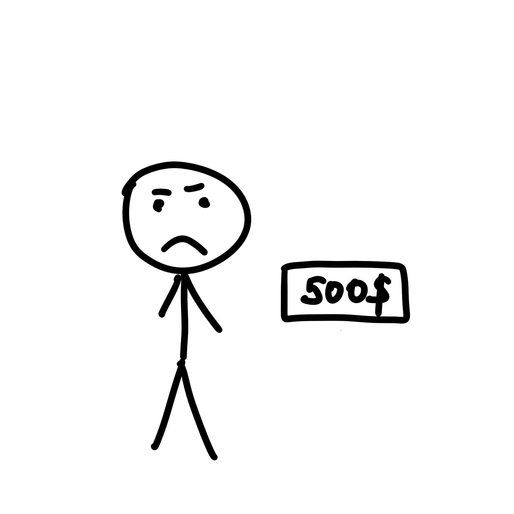
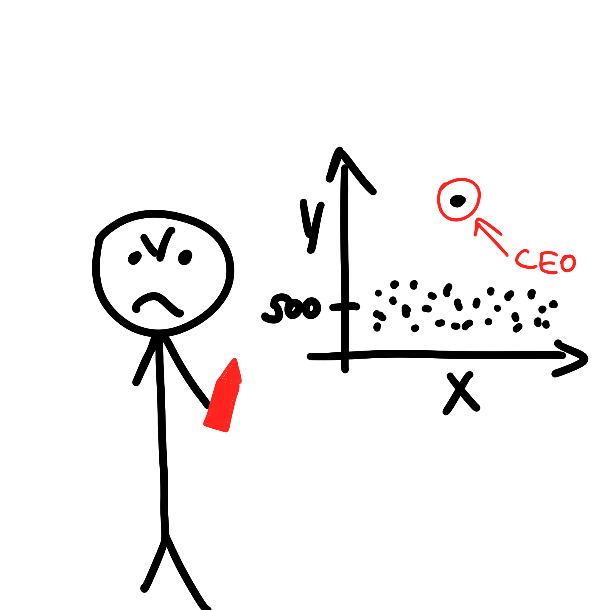

# Outliers

If you suspect the presence of outliers in your data, a scatterplot is better suited to identify them. Outliers can be
visible as data points that significantly deviate from the general trend. Conversely, line plots may not clearly exhibit
outliers as they continuously connect data points.

Однажды, во время поиска своей первой работы, Боб наткнулся на объявление о вакансии в крутой компании, где обещали
среднюю зарплату в 3000! Боб незамедлительно пошел на собеседование, где ему подтвердили эту информацию. Боб от радости
нечитая подписал все документы и приступил к работе. Однако через месяц оказалось, что он получает на руки всего 500!
Бобу хотелось разобраться почему же так получалось. Он получил доступ к данным о зарплатах всех сотрудников компании (не
совсем законно, но не будем об этом). Но сырые цифры никак не помогли бы ему разобраться в причинах этой
несправедлиовсти, поэтому Боб построил scatterplot и сразу понял, почему же средняя зарплата равна 3000. Оказывается
CEO компании получал намного больше всех остальных сотрудников компании, поэтой причине среднее значение сильно
сместилось от реальных значений зарплат. Больше Боб не работал в этой компании.

