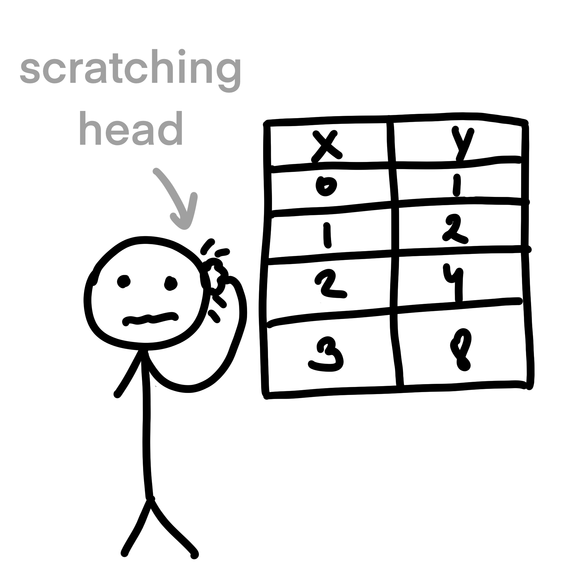
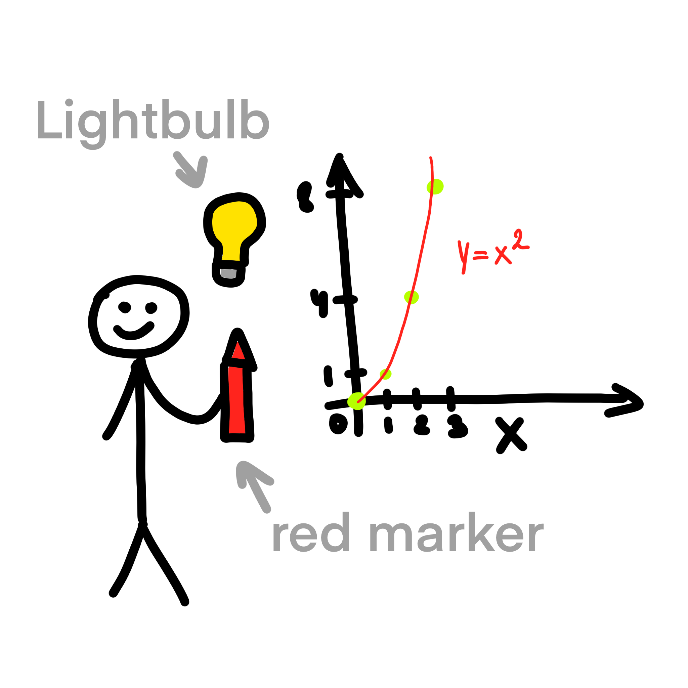

# Relationship between variables

Scatterplots are ideal when you want to visualize the relationship between two continuous variables. They show the
distribution of individual data points and help identify patterns, correlations, clusters, or outliers. On the other
hand, line plots are suitable for showing the change in a single continuous variable over time or another
continuous variable.

Let's say Bob was assigned to define relationship between variables `x` and `y`, but Bob can't see the
relationship just looking at the numbers in the table. So he decided to plot them using scatterplot. After doing that,
he immediately noticed that `y` is equal to `x` squared.

  
  

