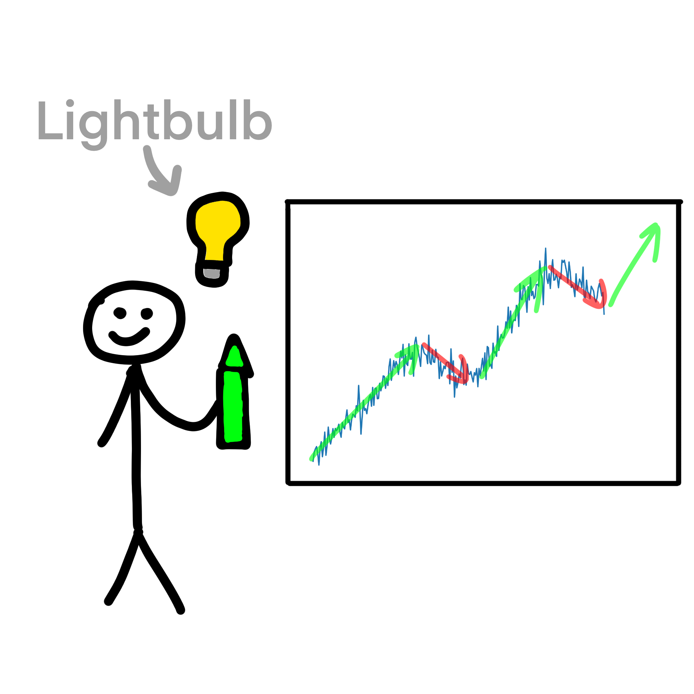

# Trend analysis

If you're interested in examining trends, a line plot is generally more effective. It displays data in a connected line,
making it easier to identify long-term patterns and changes over time. If you have a dataset with a time dimension, a 
line plot allows for a chronological representation of the data.

One day Andy tried predicting the price of “Success” LLC to invest some of his money into it. He plotted a graph of the 
company's stock price and saw an uptrend. Andy concluded that the company's share price would continue to rise, and so he
purchased shares. However, suddenly the next day, the company declared bankruptcy and the stock price plummeted 
dramatically. Andy lost a lot of money.

