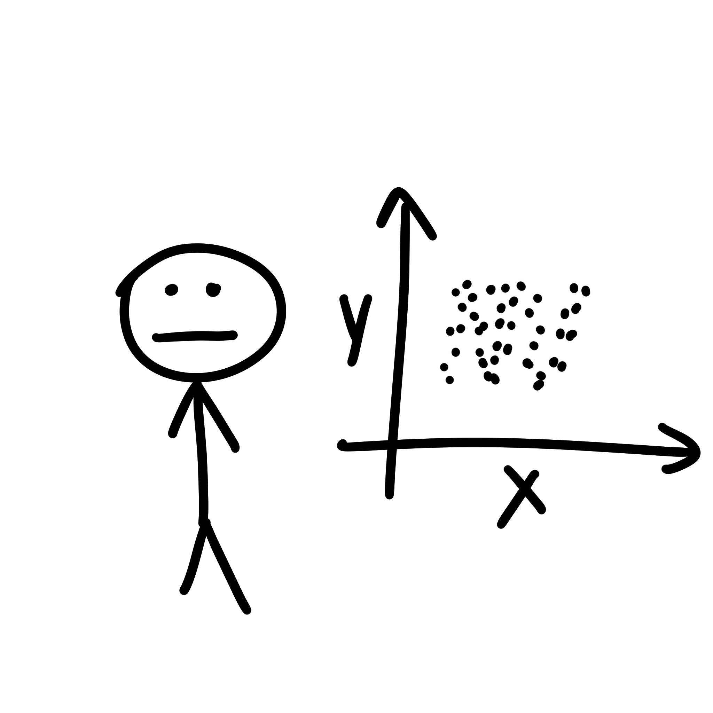
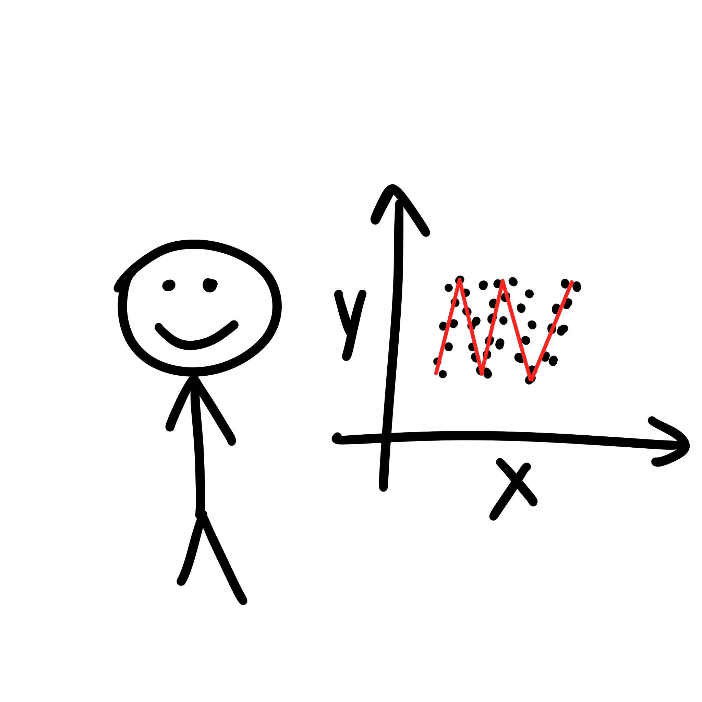

# Trend analysis

If you're interested in examining trends, a line plot is generally more effective. It displays data in a connected line,
making it easier to identify long-term patterns and changes over time. If you have a dataset with a time dimension, a
line plot allows for a chronological representation of the data.

